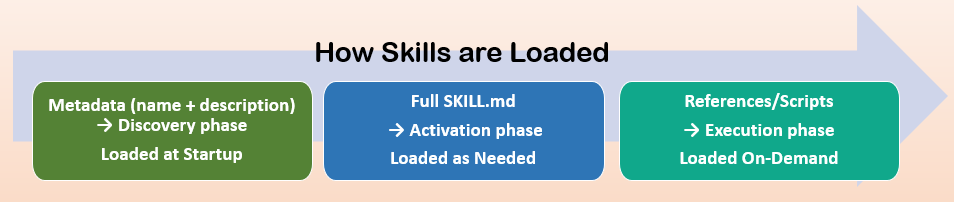

# Skills

## Section 1.1: Skill Anatomy (The Backbone)

Learning Objective: Understand what skills are, how they work, and which approach fits your
needs.

## What Are Skills?

A skill is a structured document that provides specialized knowledge or workflows to an AI agent. Think of it as giving the AI a reference manual it can consult when needed.

## Different platforms use different terms

- Anthropic: Skills (SKILL.md)
- OpenAI/Microsoft: Instructions (AGENTS.md, instructions.md)
- Google: System Instructions
- Open Source: Varies (README.md, INSTRUCTIONS.md, custom)
In this guide, we use "skill" as the generic term for any agent knowledge document.

## How Skills Work: Progressive Disclosure

Skills use a three-phase approach to manage AI context efficiently.

### Phase 1: Discovery

At startup, the AI loads only the name and description of each available skill—just enough to
know when it might be relevant.

Discovery Example

```xml
<skill>
<name>sql-query-optimization</name>
<description>Optimize slow SQL queries for PostgreSQL and MySQL.
  Use when query execution time exceeds 1 second.</description>
</skill>
```

The AI sees this lightweight summary for ALL skills without using much context.

### Phase 2: Activation

When a task matches a skill's description, the AI reads the full instructions into its working
context.
Why this matters: The AI only loads detailed instructions when needed, preventing context
overload.

### Phase 3: Execution

The AI follows the instructions, optionally loading additional resources (reference files, scripts)
as needed.

## How Skills Are Actually Loaded



**In practice, skills are loaded by agents as:**

### 1. Metadata (name + description) → Discovery phase

- Always loaded at startup
- Enables skill discovery without context overhead
- ~50-100 tokens per skill

### 2. Full SKILL.md → Activation phase

- Loaded as needed when skill is triggered
- Full instructions enter context
- ~500-5000 tokens depending on skill

### 3. References/Scripts → Execution phase

- Loaded as needed during task execution
- Loaded on-demand via explicit commands
- Only what's required, when it's required
This progressive approach keeps AI fast while giving it access to deep knowledge on demand.

## Platform Implementation Reality

Skills work best on Anthropic Claude (native API support, progressive disclosure built-in).

## Native Support

- Anthropic Claude
- Claude.ai: Web interface with native Skills support
- Claude API: Programmatic access with Skills parameter
- Claude Code: Terminal-based agentic coding with Skills
- Claude Desktop: Includes Cowork (research preview) for autonomous tasks
Note: Cowork is in research preview (Jan 2026). Skills integration & capabilities are being evaluated. See Anthropic support docs for latest status.

- Zip-and-upload simplicity
- Automatic progressive disclosure
- Full feature support

## Manual Injection Required

- OpenAI (Assistants API, Codex with $skill-installer)
- Google Gemini (system_instruction parameter)
 Requires reading SKILL.md and injecting into system prompt
- No automatic progressive disclosure
- May hit token limits with multiple skills

This curriculum teaches the Anthropic approach, which represents the intended design pattern. As the ecosystem matures, expect other platforms to adopt native skill support.

→ For platform-specific implementation code, see Appendix D: Cross-Platform
Implementation (Updated Jan 2026)

## Skill Classification System

Skills are classified by complexity, which determines the appropriate template and architecture.


### Class A: Simple Skills

**Characteristics:**

- Formatting rules, style guides, organizational constraints
- < 100 lines typical
- Minimal or no examples needed
- User validates output (no automated verification)
- Tool usage: Reasoning only OR 1-2 read-only tools

### Class A Examples

- "Always use Oxford commas in documentation"
- "Format dates as YYYY-MM-DD"
- "Use company disclaimer in client emails"
Architecture: Single-file (SKILL.md only)

→ Use Section 1.2 (Basic Skills Template)

### Class B: Intermediate Skills

### Class B Characteristics

- Decision logic, conditional workflows
- 100-500 lines typical
- Examples required for clarity
- Tests or verification scripts helpful
- Tool usage: 2-5 tools, may include state-change tools

### Class B Examples

- "Email formatting with contact directory lookup"
- "Code review following team standards"
- "Content moderation with escalation rules"
Architecture: Single-file with optional references/

→ Use Section 1.3 (Advanced Skills) for multi-file architecture

### Class C: Advanced Skills

### Class C Characteristics

- Complex multi-step workflows, verification-critical
- 500+ lines (requires multi-file architecture)
- Comprehensive examples required
- Automated verification essential
- Tool usage: 5+ tools, complex orchestration, tool composition

### Class C Examples

- "SQL query optimization with automated verification"
- "Security code review with vulnerability scanning"
- "Multi-stage data pipeline with validation"
Architecture: Multi-file (SKILL.md + references/ + scripts/)

→ Use Section 1.3 (Advanced Skills)

## Choosing Your Skill Class: Decision Tree


## **The Agent Skills Standard**

Skills follow an open standard that works across platforms (Anthropic, OpenAI, Google, and others). Agent Skills are folders of instructions, scripts, and resources that agents can discover and use to do things more accurately and efficiently. Agent Skills open standard represents a significant advancement in AI technology, providing a framework for enhanced functionality, interoperability, and enterprise management in AI applications.
<https://agentskills.io/home>

### Required Structure-**Every skill must have**


- A **directory** with the skill name

your-skill-name/

- A **SKILL.md file with YAML frontmatter**

name: your-skill-name

description: What this skill does and when to use it

- **Markdown body** with instructions

Your Skill Title

[Instructions for the AI...]

### Optional Additions

Frontmatter fields (optional)

- license - Licensing information
- compatibility - Environment requirements
- metadata - Additional properties (author, version, etc.)

Directories (optional)

- references/ - Detailed documentation (Class B/C)
- scripts/ - Executable code for automation/verification (Class C)
- assets/ - Templates, images, data files
→ For complete specification details, see the Agent Skills Standard

## Core Components of Every Skill

***Regardless of class (A/B/C), every effective skill contains these elements:**


### The 8 Essential Components

1. Purpose Statement - What problem this skill solves (1 sentence)

2. When to Use / NOT Use - Trigger conditions and exclusions

3. Core Decision Criteria - IF-THEN logic for decisions

4. Examples - Concrete demonstrations

5. Anti-Patterns - What NOT to do

6. Success Criteria - Observable outcomes

7. Unload Conditions - When to stop using this skill

8. Self-Verification - How to validate success

## How components scale by class

- Class A: Minimal versions (purpose + basic triggers + simple pattern)
- Class B: Standard versions (all components, moderate detail)
- Class C: Comprehensive versions (components + references + scripts)

### You'll learn how to implement each component in-

- Section 1.2 (Basic approach for Class A)
- Section 1.3 (Advanced approach for Class B/C)
- Section 1.5 (Deep dive - comprehensive guide to each component)

## Semantic Tags: A Model-Optimized Approach

Skills use XML-style semantic tags to signal importance and structure to AI models.

### XML Example

### Why tags instead of bold text or emojis?

- AI models are trained on XML/HTML structures
- Tags have clear, unambiguous semantic meaning
- No tokenization issues or accessibility problems
- Can be parsed and validated programmatically

### Basic tags you'll use immediately

```xml
 <critical> - Must-follow instructions
 <good_pattern> - Recommended approaches
 <bad_pattern> - Approaches to avoid
→ For the complete tag system (18 tags), see Section 1.4 (Semantic Tags)
```

## Context Management: The Critical Constraint

**The most important thing to understand about skills:**

AI context fills up fast, and performance degrades as it fills.
Every message, every file read, every command output consumes context. A single debugging session might use tens of thousands of tokens.

When context is nearly full:

- AI may "forget" earlier instructions
- Performance degrades
- Mistakes become more frequent

### How skills help

- Progressive disclosure - Load only what's needed, when needed
- Unload conditions - Tell AI when to stop using a skill
- References/ - Keep detailed content external until required
- Class system - Simpler skills = lighter context load

**This is why we emphasize:**

- Keep SKILL.md under 500 lines
- Use clear trigger and exit conditions
- Split complex skills into references/
- Choose appropriate class (A/B/C)

## How Skills and Tools Work Together

**Skills provide domain knowledge and decision criteria.**
**Tools provide executable capabilities.**

### Example workflow

1. User: "Send a summary email to the team"
2. Skill (email-formatting) activates:

- Knows company email standards
- Knows when to use formal vs. casual tone
- Provides email structure template

3.Tool (lookup_contact) executes:

- Retrieves recipient information

4.Tool (send_email) executes:

- Takes formatted content from skill
- Sends via SMTP
- Returns success/failure

5.Skill validates:

- Checks email was sent
- Verifies format was applied
- Unloads when complete

## Tool complexity affects skill class

- Class A: No tools or 1-2 read-only tools
- Class B: 2-5 tools, possibly state-changing
- Class C: 5+ tools, complex orchestration

→ For tool design patterns, see Tool Literacy module in docs>Tools Folder

## Common Skill Patterns

Rather than prescribing a "standard library," here are the common skill categories you'll encounter:

1. Formatting & Style (typically Class A)

- Code formatting (PEP8, ESLint configurations)
- Document style guides (Oxford commas, date formats)
- Brand voice guidelines (tone, terminology)
- Organizational standards (file naming, commit messages)

2.Decision Logic (typically Class B)

- Code review checklists
- Content moderation rules
- Approval workflows
- Escalation procedures

3.Domain Expertise (typically Class B or C)

- SQL query optimization
- Security vulnerability analysis
- Legal document review
- Medical coding assistance
- Financial analysis

4.Multi-Step Workflows (typically Class C)

- CI/CD pipeline orchestration
- Data migration procedures
- Incident response playbooks
- Quality assurance processes

5.Verification & Testing (typically Class C)

- Automated testing frameworks
- Compliance checking
- Security auditing
- Performance validation

### Public skill libraries

- Anthropic Skills Hub
- GitHub repositories tagged with #agent-skills
- Platform-specific marketplaces
- Community-maintained collections
Your skills may combine multiple patterns. For example, a "secure code review" skill might include domain expertise (security) + decision logic (review criteria) + verification (automated
scanning).

## Skills in the Ecosystem

**Skills don't work in isolation—they're part of a larger agent architecture:**


### How the components work together

Skills (Filesystem):

- Provide procedural knowledge and specialized expertise
- Loaded progressively as needed
- Persist across conversations

Agent (Central LLM + Tools):

- Orchestrates all components
- Decides when to load Skills
- Executes Tools - Delegates to Subagents
- Connects to MCP Servers

MCP Servers:

- Provide external data access (databases, APIs, Google Drive, etc.)
- Skills teach the agent HOW to use this data
- Always available to the agent

Subagents:

- Handle specialized tasks with isolated context
- Can themselves use Skills
- Report back to main agent
- Enable parallelization

### Skill-Agent Example workflow

1. User: "Analyze our Q4 campaign data from BigQuery"
2. Agent loads `analyzing-marketing-campaign` skill (procedural knowledge)
3. Agent connects to BigQuery via MCP Server (data access)
4. Skill guides agent on HOW to analyze the data (decision criteria)
5. Agent might spawn Subagent for detailed analysis (task delegation)
6. Results returned to user

**Key insight: Skills provide the "HOW," MCP provides the "WHERE," Tools** **provide the "WHAT,"Subagents provide the "WHO."**

For detailed comparison, see the Summary table below:


### Related

- Tool Literacy module: How to design tools that Skills orchestrate

### Choosing Your Path

Now that you understand the fundamentals, choose your path based on your skill class:

### → I'm Building Class A Skills (Simple)

What you need:

- Fill-in-the-blank template
- Basic examples
- Minimal complexity
Go to: Section 1.2 (Basic Skills Template)

You'll create a working skill in minutes.

### → I'm Building Class B/C Skills (Intermediate/Advanced)

What you need:

- Multi-file architecture guidance (Class C)
- References/ and scripts/ patterns (Class C)
- Tool orchestration strategies (Class B/C)
- Self-verification frameworks (Class B/C)
Go to: Section 1.3 (Advanced Skills)

You'll learn to build production-grade skills that scale.

## → I Want Deep Understanding First

What you need:

- Comprehensive understanding of semantic tags
- Deep dive into each of the 8 components
- Common mistakes and how to avoid them
- Testing and validation strategies

Go to:

- Section 1.4 (Semantic Tags) - All 19 tags explained
- Section 1.5 (Required Components Deep Dive) - Exhaustive guide
- Section 1.6 (Common Pitfalls) - Failure pattern recognition

## Key Takeaways

**Before moving forward, make sure you understand:**
**Skills are structured documents that give AI specialized knowledge**

Progressive disclosure keeps AI context lean:

- Metadata always loaded (~50-100 tokens)
- SKILL.md loaded when triggered (~500-5000 tokens)
- References/scripts loaded on-demand

**Three skill classes based on complexity and tool usage:**

- Class A: Simple (< 100 lines, 0-2 tools)
- Class B: Intermediate (100-500 lines, 2-5 tools)
- Class C: Advanced (500+ lines, 5+ tools, multi-file)

**Every skill needs 8 components:**

- Purpose, Triggers/Exclusions, Decision Criteria, Examples, Anti-Patterns, Success Criteria, Unload Conditions, Self-Verification

**Semantic tags provide clear structure for AI interpretation**
**Context management is the critical constraint to respect**

**Skills and tools work together:**

- Skills provide knowledge and logic
- Tools provide execution capability
- Tool complexity affects skill class

### Platform reality

- Anthropic has native support
- Others require manual injection (for now)

## Next Steps

Ready to build?

### Choose your class

- Class A (Simple): → Section 1.2 (Basic Skills Template)
- Class B/C (Intermediate/Advanced): → Section 1.3 (Advanced Skills)

### Want deeper understanding

- Tags → Section 1.4
- Components → Section 1.5
- Pitfalls → Section 1.6
- Quick Reference Resources

### Official Documentation

- Agent Skills Specification <https://platform.claude.com/docs/en/agents-and-tools/agent-skills/overview>
- Agent Skills Integration Guide <https://agentskills.io/integrate-skills>
- Example Skills Repository <https://github.com/anthropics/skills>, <https://agentskills.io/home>

Related Curriculum Sections

- Tool Literacy: Designing Tools (How skills and tools interact)
- Tool Templates

END OF SECTION 1.1

Document Version: 2.0.0
Last Updated: 2026-02-20


