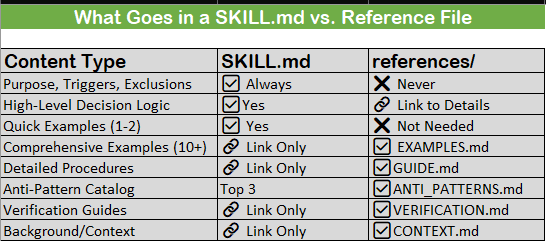

# Skills_1.3_Advanced_Skills_ClassB-C

**For:** Experienced users building complex skills
**Prerequisites:** Section 1.1 (foundation), understanding of Class A basics
**What you'll learn:** Multi-file architecture, self-verification, tool orchestration

## When You Need Advanced Skills

**You're in Class B/C territory if:**

**Class B Indicators (Intermediate)**
• Decision logic requires 2-4 examples to clarify
• Uses 2-5 tools (may include state-change tools)
• 100-500 lines of content
• Verification tests helpful but not required
• Single-file with optional references/

**Class C Indicators (Advanced)**
• Complex multi-step workflows
• Requires automated verification (tests, scripts, linters)
• Uses 5+ tools with orchestration/composition
• 500+ lines (requires multi-file architecture)
• References/ and scripts/ directories essential

**Decision point:** If your SKILL.md is approaching 300 lines, start planning multi-file architecture.

## The 500-Line Constraint

**Why 500 lines matters:**

**From Anthropic's research:**

• AI context fills fast (~200K tokens typical)
• Performance degrades as context approaches capacity
• Shorter skills = faster loading, better performance
• Progressive disclosure requires external content

**The solution:** Keep SKILL.md as overview (< 500 lines), externalize details to references/.

**What goes where:**



## Multi-File Architecture

### Directory Structure

**Class B (Intermediate):**

```text
skill-name/
├── SKILL.md # 100-500 lines
└── references/ # Optional
└── EXAMPLES.md # Extended examples if needed

**Class C (Advanced):**

skill-name/
├── SKILL.md # Overview (< 500 lines)
├── references/ # Detailed content
│ ├── EXAMPLES.md # 10+ comprehensive examples
│ ├── VERIFICATION.md # How to validate success
│ ├── GUIDE.md # Step-by-step procedures
│ ├── ANTI_PATTERNS.md # Common mistakes catalog
│ └── CONTEXT.md # Background information
└── scripts/ # Automation
├── verify.sh # Automated verification
├── test_suite.py # Test harness
└── lint_check.sh # Code quality checks
```

## SKILL.md: The Overview Pattern

**For Class B/C, SKILL.md becomes a routing document:**

```xml

---
name: sql-query-optimization
description: Optimize slow SQL queries with automated verification
---

# SQL Query Optimization

Purpose: Systematic optimization of slow database queries with verification.

<critical>
Do NOT use for:
 - Schema design → use database-schema-design skill
 - Syntax errors → use sql-debugging skill
 - NoSQL databases → use nosql-optimization skill
</critical>
```

---

```xml

## When to Use

[2-3 sentences with triggers]
```

---

```xml

## Decision Framework

<decision_criteria>
<logic>
IF query execution time > threshold:
 → Run EXPLAIN ANALYZE (see references/GUIDE.md section 2)
 → Identify bottleneck type
 → Apply targeted optimization
 → Verify improvement (scripts/verify.sh)
</logic>

**For detailed decision tree with 20+ scenarios:**
→ See references/GUIDE.md
</decision_criteria>

## Quick Example

<example>
**Before:** 2.3s execution time
**Action:** Added index to user_id foreign key
**After:** 0.05s execution time (46x improvement)

For 15+ comprehensive examples with EXPLAIN output:
 → See references/EXAMPLES.md
</example>
```

---

```xml

## Verification

<verification>
Run automated verification:
```bash
./scripts/verify.sh <query_file>
For manual verification procedures: → See references/VERIFICATION.md </verification>

---

**Common Mistakes**

<bad_pattern> Top 3 anti-patterns:
  1. Adding indexes without measuring (see ANTI_PATTERNS.md #1)
  2. Using DISTINCT to hide JOIN errors (see ANTI_PATTERNS.md #3)
  3. Optimizing without verifying improvement (see ANTI_PATTERNS.md #7)

For complete catalog of 15 anti-patterns: → See references/ANTI_PATTERNS.md </bad_pattern>
[Rest of skill with links to references...]

**Key pattern:** Overview + links. Keep SKILL.md scannable, externalize depth.
```

---

```xml

## references/: Content Organization

### **EXAMPLES.md Pattern**

**Purpose:** Comprehensive before/after examples with technical details

**Structure:**

```markdown

# SQL Optimization Examples

## Example 1: Missing Index on Foreign Key

**Scenario:** JOIN query on unindexed user_id column

**Before (2.3 seconds):**

```sql

SELECT orders.*, users.name
FROM orders
JOIN users ON orders.user_id = users.id
WHERE orders.status = 'pending';
**EXPLAIN Output (Before):**
Seq Scan on orders (cost=0.00..18234.00 rows=247)
  Filter: (status = 'pending'::text)
Seq Scan on users (cost=0.00..12456.00 rows=1000000)
**Analysis:**
  • Full table scan on orders (1M rows)
  • Nested loop join without index
  • Cost estimate: 18234
**Solution:**
CREATE INDEX idx_orders_user_id ON orders(user_id);
CREATE INDEX idx_orders_status ON orders(status);
**After (0.05 seconds):**
**EXPLAIN Output (After):**
Index Scan using idx_orders_status (cost=0.29..8.31 rows=247)
Index Scan using idx_orders_user_id (cost=0.29..3.14 rows=1)

**Results:**
  • Execution time: 2.3s → 0.05s (46x faster)
  • Cost: 18234 → 11.45 (99.9% reduction)
  • I/O operations: 98% reduction

**Verification:**
./scripts/verify.sh --query orders_by_user.sql
✓ Performance improved by 4500%
✓ Index usage confirmed
✓ No regression on related queries

**Example 2: SELECT * Inefficiency**
[15+ more examples with same depth...]

**Guidelines for EXAMPLES.md:**
- 10-20 comprehensive examples
- Include EXPLAIN output (technical depth)
- Show verification results
- Cover edge cases
- Measurable improvements (X% faster, Y% cost reduction)

---

### **VERIFICATION.md Pattern**

**Purpose:** How to validate that optimization succeeded

**Structure:**

```markdown

# Verification Guide

## Automated Verification

### Using verify.sh Script

```bash

# Basic usage

./scripts/verify.sh <query_file>

# With baseline comparison

./scripts/verify.sh --baseline baseline.json <query_file>

# Generate report

./scripts/verify.sh --report output.html <query_file>

**What verify.sh checks:**

  1. Execution time improvement (>50% required)
  2. EXPLAIN output shows index usage
  3. Query plan cost reduction
  4. No regression in related queries (test suite)
  5. Resource usage (memory, I/O)

Manual Verification (When Scripts Unavailable)

**Step 1: Baseline Measurement**

EXPLAIN (ANALYZE, BUFFERS) [your query];

Record:
• Execution time
• Planning time
• Buffers (shared hits, reads)
• Rows examined

**Step 2: Apply Optimization**

[Your changes]

**Step 3: Verify Improvement**

EXPLAIN (ANALYZE, BUFFERS) [your query];

Compare:

• ✓ Execution time reduced >50%
• ✓ Index scans replace Seq Scans
• ✓ Buffers reduced
• ✓ Cost estimate lower

**Step 4: Regression Check**

### Run test suite on related queries:

./scripts/test_suite.py --regression-check
Verify no queries got slower.

**Interpreting EXPLAIN Output**
[Detailed guide to reading EXPLAIN...]

**Troubleshooting Failed Verifications**

**Issue:** Index not being used Cause: Statistics outdated **Fix:** ANALYZE table_name;

[10+ more troubleshooting scenarios...]

---

### **GUIDE.md Pattern**

**Purpose:** Step-by-step procedures, decision trees, technical deep dives

**Structure:**

```markdown

# SQL Optimization Guide

## Decision Tree: Identifying Bottleneck Type

```text
START: Query is slow

Is execution time the problem? ├─ YES → Continue └─ NO → Check planning time (statistics
issue)

Run: EXPLAIN ANALYZE query

Does output show "Seq Scan" on large table? ├─ YES → Bottleneck Type: Missing Index │ └─ Go
to Section 3: Index Optimization └─ NO → Continue

Does output show "Nested Loop" with high cost? ├─ YES → Bottleneck Type: Join Strategy │ └─

Go to Section 4: Join Optimization └─ NO → Continue

Does output show "Sort" or "HashAggregate"? ├─ YES → Bottleneck Type: Aggregation │ └─ Go
to Section 5: Aggregation Optimization └─ NO → Continue

[20+ decision points...]
```

---

## Section 3: Index Optimization

### When to Add Index

**Criteria:**

1. Table has >10K rows
2. Column appears in WHERE, JOIN, or ORDER BY
3. Column has moderate cardinality (not all unique, not all same)
4. Query runs frequently (>100 times/day)

### Index Selection Algorithm

Step 1: Identify Candidate Columns

```sql
-- Find columns used in WHERE clauses

SELECT column_name, COUNT(*) as usage_count

FROM query_log

WHERE clause_type = 'WHERE'

GROUP BY column_name

ORDER BY usage_count DESC;

**Step 2: Check Cardinality**

## SELECT

  column_name,
  COUNT(DISTINCT column_name) as distinct_values,
  COUNT(*) as total_rows,
  (COUNT(DISTINCT column_name)::float / COUNT(*)) as cardinality_ratio
  FROM table_name;
*Rule:* Index if cardinality_ratio > 0.01 (1%)

**Step 3: Create Index**
CREATE INDEX idx_table_column ON table_name(column_name);

**Step 4: Verify Usage**
EXPLAIN ANALYZE [your query];
Look for: Index Scan using idx_table_column
[Continue with sections 4, 5, 6...]

---

### **ANTI_PATTERNS.md Pattern**

**Purpose:** Comprehensive catalog of mistakes to avoid

**Structure:**
```markdown

# SQL Optimization Anti-Patterns

## Anti-Pattern #1: Index Without Measurement

### What It Looks Like

```sql

-- "This query seems slow, let me add an index"

CREATE INDEX idx_orders_everything ON orders(user_id, status, created_at, total);

**Why This Is Wrong**

1. No baseline measurement (don't know if slow)
2. Composite index may not be used (column order matters)
3. No verification of improvement
4. Added write overhead without confirmed benefit


**The Cost**

• Index maintenance on every INSERT/UPDATE (~20% overhead)
• Storage cost (~15% of table size)
• May not even be used by query planner

**How to Fix**

<good_pattern>

1. MEASURE FIRST

EXPLAIN ANALYZE SELECT * FROM orders WHERE user_id = 123;
-- Record: 2.3 seconds

2. ADD TARGETED INDEX

CREATE INDEX idx_orders_user_id ON orders(user_id);

3. VERIFY IMPROVEMENT

EXPLAIN ANALYZE SELECT * FROM orders WHERE user_id = 123;

-- Record: 0.05 seconds (46x faster)

4. RUN REGRESSION TESTS

./scripts/test_suite.py --check-related-queries</good_pattern>

**Key principle:** Measure → Optimize → Verify

**Anti-Pattern #2: Using DISTINCT to Hide JOIN Problems**

[15+ more anti-patterns with same depth...]

---

## scripts/: Automation Patterns

### **verify.sh Pattern**

**Purpose:** Automated verification that optimization succeeded

**Example implementation:**

```bash

#!/bin/bash

# scripts/verify.sh - Verify SQL query optimization

set -e

QUERY_FILE=$1
BASELINE_FILE=${2:-baseline.json}
THRESHOLD=50 # Minimum improvement percentage

# Colors for output

RED='\033[0;31m'
GREEN='\033[0;32m'
NC='\033[0m'

echo "Verifying optimization for: $QUERY_FILE"

# Step 1: Run EXPLAIN ANALYZE

echo "Running EXPLAIN ANALYZE..."
RESULT=$(psql -d $DB_NAME -t -c "EXPLAIN (ANALYZE, FORMAT JSON) $(cat $QUERY_FILE)")

# Extract metrics

EXECUTION_TIME=$(echo $RESULT | jq '.[0]."Execution Time"')
PLANNING_TIME=$(echo $RESULT | jq '.[0]."Planning Time"')
TOTAL_TIME=$(echo "$EXECUTION_TIME + $PLANNING_TIME" | bc)

# Step 2: Load baseline

if [ -f "$BASELINE_FILE" ]; then
  BASELINE_TIME=$(jq '.total_time' $BASELINE_FILE)
  IMPROVEMENT=$(echo "scale=2; (($BASELINE_TIME - $TOTAL_TIME) / $BASELINE_TIME) *
100" | bc)

  echo "Baseline: ${BASELINE_TIME}ms"
  echo "Current: ${TOTAL_TIME}ms"
  echo "Improvement: ${IMPROVEMENT}%"

# Step 3: Check threshold

if (( $(echo "$IMPROVEMENT > $THRESHOLD" | bc -l) )); then
  echo -e "${GREEN}✓ Verification PASSED${NC}"
  echo -e " Performance improved by ${IMPROVEMENT}%"
else
  echo -e "${RED}✗ Verification FAILED${NC}"
  echo -e " Improvement (${IMPROVEMENT}%) below threshold (${THRESHOLD}%)"
  exit 1

fi

else
  echo "No baseline found. Saving current as baseline..."
  echo "{\"total_time\": $TOTAL_TIME}" > $BASELINE_FILE

fi

# Step 4: Check index usage

echo ""

echo "Checking index usage..."

INDEX_SCANS=$(echo $RESULT | jq '.[0].Plan | .. | objects | select(.["Node Type"] == "Index
Scan") | .["Node Type"]' | wc -l)

if [ $INDEX_SCANS -gt 0 ]; then
  echo -e "${GREEN}✓ Query uses indexes${NC} ($INDEX_SCANS index scans)"
else
  echo -e "${RED}⚠ Query does NOT use indexes${NC}"
  echo " Consider adding indexes or running ANALYZE"

fi

# Step 5: Run regression tests

echo ""
echo "Running regression tests..."
./scripts/test_suite.py --regression-check

echo ""

echo -e "${GREEN}✓ All verifications passed${NC}"

**Key features:**
• Automated EXPLAIN ANALYZE execution
• Baseline comparison
• Threshold checking (>50% improvement required)
• Index usage verification
• Regression test integration
• Color-coded output

### test_suite.py Pattern

**Purpose:** Ensure optimization doesn't break related queries
#!/usr/bin/env python3

"""

Test suite for SQL query optimization
Ensures no regressions in related queries

"""

import psycopg2
import json
import sys
from typing import List, Dict


class QueryTestSuite:
def __init__(self, db_conn_string: str):
   self.conn = psycopg2.connect(db_conn_string)
   self.baseline_file = "test_baseline.json"

def load_baseline(self) -> Dict:
    """Load baseline query performance"""
    with open(self.baseline_file, 'r') as f:
      return json.load(f)


def run_query_with_timing(self, query: str) -> float:
  """Execute query and return execution time in ms"""
  with self.conn.cursor() as cur:
    cur.execute(f"EXPLAIN (ANALYZE, FORMAT JSON) {query}")
    result = cur.fetchone()[0]
    return result[0]['Execution Time']

def check_regression(self, test_queries: List[str]) -> bool:
   """Check if any query got slower"""
   baseline = self.load_baseline()
   failed_tests = []
   print(" Running regression tests...\n")

for i, query in enumerate(test_queries, 1):
    query_hash = hash(query)
    baseline_time = baseline.get(str(query_hash), None)

    current_time = self.run_query_with_timing(query)


    if baseline_time:
       change_pct = ((current_time - baseline_time) / baseline_time) * 100

    if change_pct > 10: # More than 10% slower = regression
       failed_tests.append({
          'query_num': i,
          'baseline': baseline_time,
          'current': current_time,
          'regression': change_pct
          
       })

        print(f" ✗ Query {i}: REGRESSION ({change_pct:+.1f}%)")

    else:
        print(f" ✓ Query {i}: OK ({change_pct:+.1f}%)")

    else:
        print(f" ⚠ Query {i}: No baseline (saving current)")
        baseline[str(query_hash)] = current_time

# Save updated baseline

with open(self.baseline_file, 'w') as f:
    json.dump(baseline, f, indent=2)

# Report results
print(f"\n{'='*50}")
if failed_tests:
    print(f" {len(failed_tests)} regression(s) detected:")
    for test in failed_tests:
       print(f" Query {test['query_num']}: "
       f"{test['baseline']:.2f}ms → {test['current']:.2f}ms "
       f"({test['regression']:+.1f}%)")
    return False
else:
    print(f" All {len(test_queries)} tests passed")
    return True

# Test queries (related to optimization)

TEST_QUERIES = [
    "SELECT * FROM orders WHERE user_id = 123",
    "SELECT * FROM orders WHERE status = 'pending'",
    "SELECT COUNT(*) FROM orders GROUP BY user_id",
    # ... 20+ related queries
]

if __name__ == "__main__":
    suite = QueryTestSuite("postgresql://localhost/mydb")
    success = suite.check_regression(TEST_QUERIES)
    sys.exit(0 if success else 1)

```

## Self-Verification: The #1 Priority

**From Anthropic's Best Practices:**
"Include tests, screenshots, or expected outputs so Claude can check itself. **This is the single highest-leverage thing you can do.**"

### Why Self-Verification Matters

**Without verification:**
• AI produces plausible-looking output that doesn't work
• Errors compound (bad optimization → worse performance)
• User becomes the only feedback loop
• Every mistake requires human intervention

**With verification:**
• AI can iterate autonomously
• Catches errors immediately
• Builds confidence through validation
• Reduces human review burden

### Verification Strategies by Type

**Code Changes:**
• Unit tests (pytest, jest, etc.)
• Integration tests
• Linters (pylint, eslint)
• Type checkers (mypy, TypeScript)

**Query Optimization:**
• EXPLAIN ANALYZE comparison
• Execution time thresholds
• Index usage checks
• Regression test suite

**UI Changes:**
• Screenshot comparison (Claude in Chrome)
• Visual regression testing
• Accessibility checks (WAVE, axe)
• Cross-browser testing

**Data Transformations:**
• Row count validation
• Schema checks
• Sample data verification
• Checksum comparison

**Configuration Changes:**
• Syntax validation
• Dry-run execution
• Rollback capability
• Smoke tests

## Tool Orchestration (5+ Tools)

**Class C skills often orchestrate multiple tools in sequence.**

### Composition Patterns

### Pattern 1: Linear Pipeline

Tool A → Tool B → Tool C → Verification

**Example (Code Review):**

1. git_diff(branch) # Get code changes
2. run_linter(files) # Static analysis
3. run_tests(files) # Unit tests
4. security_scan(files) # Vulnerability check
5. verify_all_passed.sh # Verification

### Pattern 2: Conditional Branching

Tool A → Decision → Tool B (if X) OR Tool C (if Y) → Verification

**Example (SQL Optimization):**

```text

1. explain_analyze(query) # Get execution plan
2. identify_bottleneck() # Analyze output
├─ IF Seq Scan → add_index()
├─ IF Nested Loop → optimize_join()
└─ IF Sort → add_order_index()
3. verify_improvement.sh # Verification

### Pattern 3: Parallel Execution
Tool A ─┬─ Tool B ─┐
├─ Tool C ─┤─ Merge → Verification
└─ Tool D ─┘

**Example (Comprehensive Code Review):**
Parallel:
├─ run_linter() # Style checks
├─ run_security_scan() # Security
├─ run_tests() # Functionality
└─ check_coverage() # Test coverage

Merge results → generate_report() → Verification

### Pattern 4: Iterative Refinement

Tool A → Verify → (if fail) → Refine → Tool A → Verify → ...

**Example (UI Implementation):**

1. implement_ui_changes()
2. take_screenshot()
3. compare_to_design()
├─ IF match → Done ✓
└─ IF mismatch → list_differences() → fix() → repeat
```

## Error Handling Across Tools

**Challenge:** One tool failure shouldn't crash entire workflow.
**Solution:** Explicit error handling + fallback strategies

```xml
<decision_criteria>
<logic>
IF tool_a succeeds:
→ Continue to tool_b
ELSE IF tool_a fails with error_type_1:
→ Retry once with adjusted parameters
→ If still fails, use fallback_tool_x
ELSE IF tool_a fails with error_type_2:
→ Skip tool_b (not applicable)
→ Continue to tool_c
ELSE:
→ Stop workflow, report error to user
</logic>
</decision_criteria>

**Key principle:** Every tool call should have defined failure modes + recovery actions.
```

## State Management

**Challenge:** Tool outputs must be passed to subsequent tools.
**Solution:** Explicit state tracking

```xml

<workflow>
<step id="1">
Tool: git_diff(branch="feature-x")
Output: changed_files = ["app.py", "test.py", "config.yaml"]
State: Store changed_files for next step
</step>

<step id="2" depends_on="1">
Tool: run_linter(files=changed_files) # Uses state from step 1
Output: lint_errors = [...]
State: Store lint_errors for report
</step>

<step id="3" depends_on="2">
Tool: generate_report(lint_errors=lint_errors) # Uses state from step 2
Output: report.html
</step>
</workflow>

```

## Complete Class C Example

**Skill:** SQL Query Optimization with Automated Verification

**Files:**
sql-query-optimization/
├── SKILL.md # 420 lines (under 500!)
├── references/
│ ├── EXAMPLES.md # 2,100 lines (20 examples)
│ ├── VERIFICATION.md # 850 lines
│ ├── GUIDE.md # 1,600 lines (decision trees, procedures)
│ ├── ANTI_PATTERNS.md # 900 lines (15 anti-patterns)
│ └── CONTEXT.md # 400 lines (database theory)
└── scripts/
├── verify.sh # Bash (automated verification)
├── test_suite.py # Python (regression tests)
└── analyze_explain.py # Python (EXPLAIN parser)

Total: 6,270 lines across multiple files **SKILL.md: 420 lines (main entry point)**

### SKILL.md (Main File)

---

name: sql-query-optimization
description: >
  Optimize slow SQL queries for PostgreSQL and MySQL using systematic
  analysis and automated verification. Use when query execution time
  exceeds acceptable thresholds or EXPLAIN ANALYZE output is provided.
  Keywords: slow query, performance, database, optimization, EXPLAIN, index.

metadata:
  author: your-organization
  version: "2.0.0"
  last_updated: "2026-01-28"

---

```xml

# SQL Query Optimization

**Purpose:** Systematically optimize slow database queries through bottleneck analysis,
targeted improvements, and automated verification.

---

## Critical Information


<critical>
```

Do NOT use this skill for:

- Schema design or database architecture → use database-schema-design
- SQL syntax errors or debugging → use sql-debugging
- NoSQL databases (MongoDB, Redis, etc.) → use nosql-optimization
- Query that runs <100ms (acceptable performance)
- Read-only analysis without optimization authority

**Platform scope:** PostgreSQL 12+, MySQL 8+

```xml

</critical>

<prerequisite>
  Requires:

- Database access with EXPLAIN privileges
- Write permissions for CREATE INDEX (if optimization needed)
- Ability to run scripts/ tools for verification
</prerequisite>
```

---

## When to Use This Skill

```xml

<condition>


**Explicit requests:**
- "Optimize this query"
- "Why is this query slow?"
- "Can you improve query performance?"

**Observable metrics:**
- Query execution time > 1 second
- High CPU/memory usage from specific query
- Database monitoring alerts for slow query
- EXPLAIN ANALYZE output shows inefficiencies

**Available data:**
- EXPLAIN output provided
- Query source code available
- Database schema accessible

</condition>
```

---

## Decision Framework

```xml

<decision_criteria>

**Phase 1: Analysis**
<logic>
IF query execution time unknown:
→ Run EXPLAIN ANALYZE to establish baseline
→ Record execution time, plan cost, I/O metrics
</logic>

**Phase 2: Bottleneck Identification**

<logic>
Review EXPLAIN output:
IF "Seq Scan" on table with >10K rows:
  → Bottleneck: Missing Index
  → See references/GUIDE.md Section 3

ELSE IF "Nested Loop" with high cost:
  → Bottleneck: Join Strategy
  → See references/GUIDE.md Section 4
  
  ELSE IF "Sort" or "HashAggregate" with large dataset:
  → Bottleneck: Aggregation
  → See references/GUIDE.md Section 5

[10+ additional bottleneck types in GUIDE.md]
</logic>

**Phase 3: Optimization**

Apply targeted fix based on bottleneck type.
See references/GUIDE.md for complete decision tree (20+ scenarios).

**Phase 4: Verification** !REQUIRED

<logic>
Run verification:
  ./scripts/verify.sh <query_file>
  
IF improvement < 50%:
  → Try alternative optimization approach
  → See references/GUIDE.md Section 9 (Alternative Strategies)

IF improvement >= 50%:
  → Run regression tests: ./scripts/test_suite.py
  → IF no regressions: Success ✓
  → IF regressions detected: Rollback, try different approach
</logic>
</decision_criteria>

**Complete decision tree with 20+ scenarios:**
  → references/GUIDE.md
```

---

## Quick Examples

```xml

<example>

### Example 1: Missing Index

**Before:** 2.3s execution time
**Issue:** Full table scan on 1M row orders table
**Fix:** `CREATE INDEX idx_orders_user_id ON orders(user_id);`
**After:** 0.05s execution time
**Result:** 46x faster, 99.7% cost reduction

**Verification:**

```bash

./scripts/verify.sh orders_query.sql
✓ Performance improved by 4500%
✓ Index usage confirmed
✓ No regressions detected
</example> 

<example> 

### Example 2: Inefficient JOIN

**Before:** 8.1s execution time
**Issue:** Nested loop on unindexed join
**Fix:** Added composite index + forced hash join
**After:** 0.3s execution time
**Result:** 27x faster

See verification output in references/EXAMPLES.md 
</example>

**For 18 additional comprehensive examples:**

→ references/EXAMPLES.md (2,100 lines, detailed EXPLAIN output, verification results)

---

**Self-Verification (Required)**

<verification> **Automated verification (recommended):** ```bash ./scripts/verify.sh
<query_file> ```

**What it checks:**

1. Execution time improved >50%
2. EXPLAIN shows index usage
3. Query plan cost reduced
4. No regression in related queries
5. Resource usage acceptable

**Manual verification (if scripts unavailable):** → references/VERIFICATION.md (850 lines, step-by-step procedures)

**Troubleshooting failed verifications:** → references/VERIFICATION.md Section 5 
</verification>

---

**Tool Orchestration**

**This skill uses 6 tools in sequence:**

<sequence> <step id="1" required="true"> explain_analyze(query) - Establish baseline </step><step id="2" depends_on="1"> identify_bottleneck(explain_output) - Analyze execution plan</step> <step id="3" depends_on="2"> apply_optimization(bottleneck_type) - Targeted fix</step> <step id="4" depends_on="3" verification="true"> explain_analyze(query) - Measure
improvement </step> <step id="5" depends_on="4"> run_script("./scripts/verify.sh") -Automated verification </step> <step id="6" depends_on="5">
run_script("./scripts/test_suite.py") - Regression check </step> </sequence>

**Error handling:**

If any step fails → see references/GUIDE.md Section 10 (Troubleshooting)

---

**Anti-Patterns (Top 3)**

<bad_pattern> #1: **Index Without Measurement Adding indexes without measuring baseline**
performance.

**Why wrong:** Adds overhead without confirming benefit.
**Fix:** Always measure → optimize → verify.
**Full explanation:** references/ANTI_PATTERNS.md #1 
</bad_pattern>

<bad_pattern> #3: **Using DISTINCT to Hide JOIN Errors** Using DISTINCT to eliminate duplicate rows from incorrect JOINs.

Why wrong: Masks underlying problem, adds expensive sorting.

Fix: Fix JOIN conditions instead of masking symptoms.
Full explanation: references/ANTI_PATTERNS.md #3 
</bad_pattern>

<bad_pattern> 
#7: No Verification Assuming optimization worked without measuring.

Why wrong: May have made performance worse.
Fix: Always run verification: ./scripts/verify.sh
Full explanation: references/ANTI_PATTERNS.md #7 
</bad_pattern>


### For complete catalog of 15 anti-patterns:

→ references/ANTI_PATTERNS.md (900 lines)

---

Success Criteria

<success_criteria> Optimization is successful when:

✓ Performance:

• Query execution time reduced by ≥50%
• EXPLAIN cost estimate reduced
• I/O operations reduced

✓ Verification:

• ./scripts/verify.sh passes all checks
• ./scripts/test_suite.py shows no regressions
• Index usage confirmed in EXPLAIN output

✓ Production readiness:

• Tested on production-like data volume
• Edge cases verified (see references/VERIFICATION.md Section 4)
• Rollback plan documented 
</success_criteria>
```

---
When to Stop Using This Skill

```xml

<unload_condition> Stop using this skill when:

User Intent Change (CHECK FIRST):
1. User says "Actually...", "Never mind...", "Wait..."
2. User asks unrelated question (topic shift away from SQL)
3. User shows dissatisfaction with optimization approach
4. User provides contradictory requirements

Task Complete: 
5. Optimization verified successful (all checks pass) 
6. User confirms performance is acceptable 
7. Changes deployed to production

Domain Switch: 
8. User switches to schema design → activate database-schema-design 
9. User switches to debugging → activate sql-debugging 
10. User switches to NoSQL → activate nosql-optimization 11. Query is non-SQL (MongoDB, Redis) → wrong skill

Failure Mode: 
12. After 3 optimization attempts with <20% improvement → Escalate to DBA 
13. Verification consistently fails → Review requirements with user 
14. Regression tests fail repeatedly → Rollback, different approach

Explicit Stop: 
15. User says "stop optimizing" or "that's enough" 
16. User asks to explain optimization (don't apply, just teach) 
</unload_condition>
```

---

Additional Resources

```xml

<note> 
**Related skills:** 
- database-schema-design - For schema optimization 
- sql-debugging - For syntax errors 
- nosql-optimization - For MongoDB, Redis, etc.

### Reference materials:

• references/CONTEXT.md - Database optimization theory (400 lines)
• references/GUIDE.md - Complete procedures (1,600 lines)
• references/EXAMPLES.md - 20 comprehensive examples (2,100 lines)

### Tools:

• scripts/verify.sh - Automated verification
• scripts/test_suite.py - Regression testing
• scripts/analyze_explain.py - EXPLAIN parser

### Platform differences:

• PostgreSQL: Strong query planner, excellent EXPLAIN
• MySQL: Weaker planner, may need query hints
• See references/CONTEXT.md Section 6 for details 
</note>

```

## Building Your Own Class C Skill

Checklist for multi-file architecture

**SKILL.md (< 500 lines):**

- [ ] Frontmatter (name, description, metadata)
- [ ] Purpose statement (1 sentence)
- [ ] Critical information (exclusions, prerequisites)
- [ ] When to use (triggers with observable signals)
- [ ] Decision framework (high-level logic + links to GUIDE.md)
- [ ] Quick examples (1-2, link to EXAMPLES.md for more)
- [ ] Self-verification section (link to scripts/ and VERIFICATION.md)
- [ ] Tool orchestration (if using 5+ tools)
- [ ] Top 3 anti-patterns (link to ANTI_PATTERNS.md)
- [ ] Success criteria (measurable)
- [ ] Unload conditions (User Intent Change FIRST)

**references/ directory:**

- [ ] EXAMPLES.md - 10+ comprehensive examples with technical depth
- [ ] VERIFICATION.md - How to verify success (automated + manual)
- [ ] GUIDE.md - Step-by-step procedures, decision trees
- [ ] ANTI_PATTERNS.md - Comprehensive mistakes catalog
- [ ] CONTEXT.md (optional) - Background theory, platform differences

**scripts/ directory:**

- [ ] verify.sh or verify.py - Automated verification script
- [ ] test_suite.py - Regression test framework
- [ ] Additional automation as needed

**Testing:**

- [ ] Verify SKILL.md < 500 lines
- [ ] Test skill activation (triggers work)
- [ ] Test verification scripts (they actually run)
- [ ] Test on realistic scenarios
- [ ] Verify no regressions

---

## Next Steps

**You've learned advanced skill patterns.**

### **To Continue Learning:**

**Deepen component understanding:**

- **Section 1.4:** All 19 semantic tags (you've used ~8)

- **Section 1.5:** Deep dive into 8 components

- **Section 1.6:** Common pitfalls and how to avoid them

**Cross-module integration:**

- **Tool Literacy:** Design tools that skills orchestrate

### **To Implement Your Skills:**

**On Anthropic Claude:**

- Zip your skill directory (with references/ and scripts/)
- Upload via Skills API or Claude.ai interface
- Progressive disclosure works automatically

**On Other Platforms:**

- See Appendix D: Cross-Platform Implementation
- Manual injection required (read files, inject into system prompt)
- Progressive disclosure must be manual

---

## Key Takeaways

**Class B/C skills require:**

Multi-file architecture when content >300 lines

Self-verification (Anthropic's #1 priority)

Tool orchestration strategies (5+ tools)

references/ for detailed content

scripts/ for automation

SKILL.md as routing document (< 500 lines)

**The pattern:**

- Keep SKILL.md scannable (overview + links)
- Externalize depth to references/
- Automate verification with scripts/
- Test thoroughly before deploying

**Remember:** Even complex skills follow the 8 core components. The complexity is in implementation depth, not structure.

---

## **END OF SECTION 1.3**

---

*Document Version: 1.0.0*
*Last Updated: 2026-02-20
*Target Audience: Experienced users, Class B/C skills*
*Prerequisites: Section 1.1 (foundation), Class A understanding*
