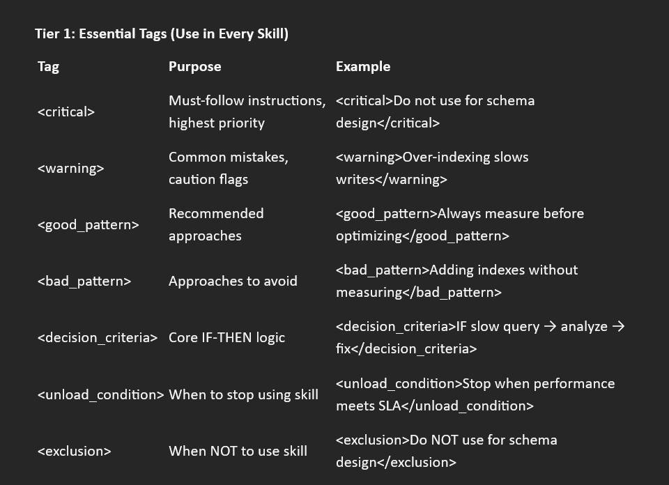
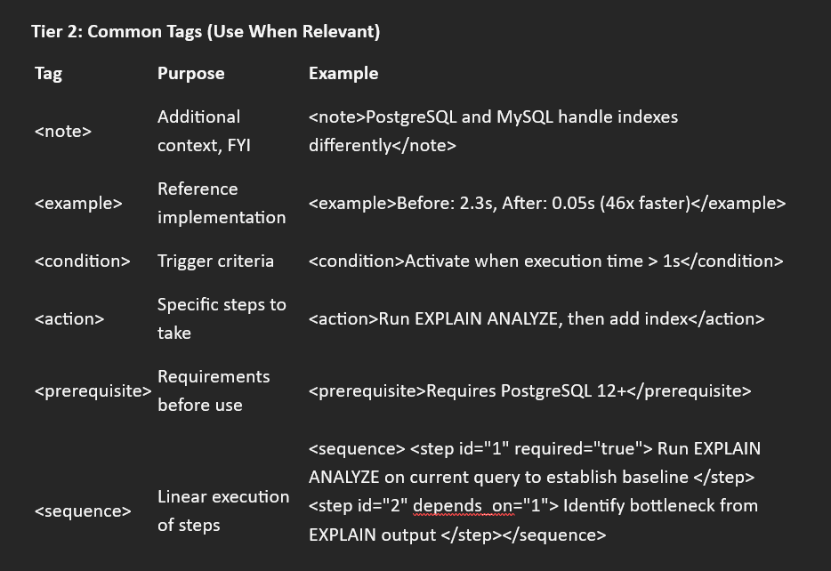

# Appendix A: Semantic Tags Reference

## Quick reference guide for all recommended semantic tags

Master the Tier 1: Essential Tags first. Use the other 11 only when you need granular control.

Tier 1: Essential Tags (Use in Every Skill)



Tier 2: Common Tags (use when relevent)



Tier 3: Advanced Tags (For Complex Skills)


## Tag Nesting Examples

### Good Pattern with Rationale

```text

<bad_pattern>
Using DISTINCT to eliminate duplicates

<rationale>
DISTINCT masks underlying JOIN problems and adds expensive sorting.
Fix JOIN conditions instead of masking symptoms.
</rationale>
</bad_pattern>
```

### Decision Criteria with Actions

```xml

<decision_criteria>

IF query shows full table scan:

<action>
1. Identify columns in WHERE clause
2. Check existing indexes
3. Create index if missing
4. Verify with EXPLAIN ANALYZE
</action>

</decision_criteria>
```

### Exclusions with Context

```Text

<exclusion>
Do NOT use for NoSQL databases
<context>
This skill is specific to SQL databases (PostgreSQL, MySQL).
For NoSQL optimization, use database-specific skills:
- MongoDB → mongodb-optimization
- Redis → redis-optimization
</context>

</exclusion>
```

## Usage Principles

### Do

```text

1. Use tags for semantic meaning (priority, warning, example)
2. Nest tags when it adds clarity
3. Close all tags properly
4. Combine tags (e.g., <bad_pattern> + <rationale>)
```

### Don't

```text
1. Mix emojis with tags (choose one system)
2. Over-tag every sentence
3. Invent new tags without good reason
4. Use tags for formatting (use Markdown for that)
```

END OF SKILLS **A SEMANTIC TAG REFERENCE**
version 1.0   2026-02-24
