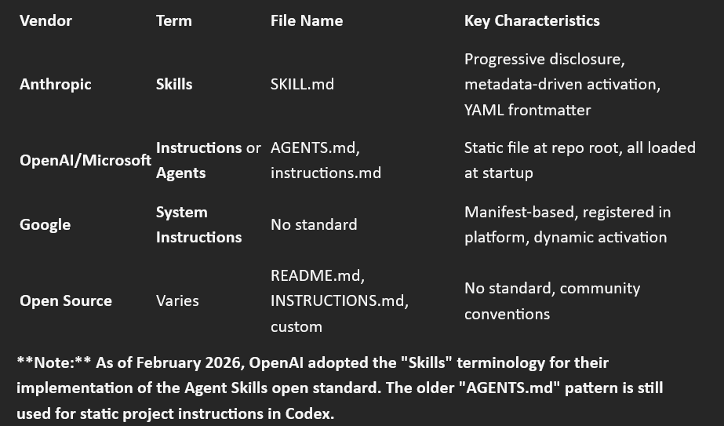
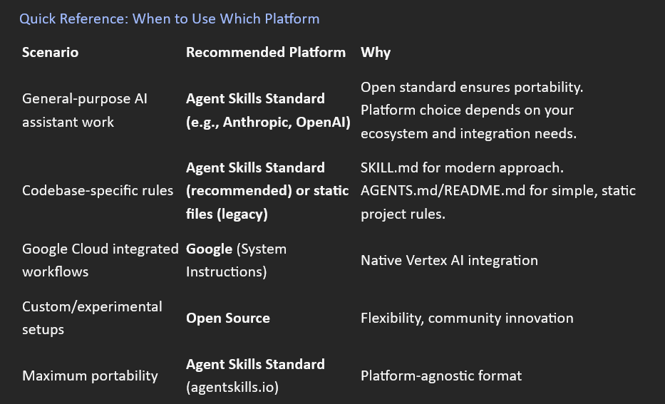

# Appendix D: Cross-Platform Implementation & Resources

**Purpose:** Brief guide to Skills across AI platforms with links to official resources
**Note:** Platforms evolve rapidly—always check official documentation for latest implementation details

## Introduction

Skills (also called "Instructions.md," "Agents.md", or "System Instructions" depending on platform) are a universal concept in AI system design,
but each platform implements them differently.

## This appendix provides

```text

• Universal principles that apply across all platforms
• Platform-specific implementation notes (brief)
• Terminology landscape (what each vendor calls Skills)
• Conversion guidance (adapting skills between platforms)
• Anthropic resources and repositories
```
**Important:** AI platforms are evolving rapidly. The popularity and ease-of-use of Anthropic's Skills implementation is likely to influence
how other platforms approach this concept. Always consult official documentation for the latest implementation details.

## Universal Principles

**Regardless of platform, effective agent knowledge documents share these characteristics:**

### 1. Progressive Disclosure

**Principle:** Load only what's needed, when it's needed.

**Why it matters:**

```text
• Reduces cognitive load on the model
• Keeps context focused and relevant
• Enables larger knowledge bases without overload
• Improves performance by avoiding irrelevant information
**How Anthropic implements:** Metadata-driven activation (skills load based on name and description matching user intent)
**How others might implement:** Varies by platform (some load all instructions at startup, others support dynamic loading)
```

### 2. Metadata-Driven Discovery

**Principle:** Name and description enable automatic activation.

**Why it matters:**

```text

• Models can discover and activate appropriate skills
• No manual switching required
• Enables skill composition (multiple skills active)
• Scales to large skill libraries

Universal pattern:

name: skill-identifier
description: What this does and when to use it. Keywords: relevant, terms.
```
**All platforms benefit from clear naming and descriptions, even if they don't use YAML frontmatter.**

### 3. Structured Decision Criteria

**Principle:** Use IF-THEN patterns for decision logic.

**Why it matters:**

```text

• Clear, parseable logic
• Models understand conditional execution
• Reduces ambiguity
• Enables verification
**Universal pattern:**
IF [observable condition]:
→ [Specific action]
→ [Expected outcome]
```
**This works across Anthropic, OpenAI, Google, and open-source implementations.**

### 4. Cognitive Load Management

**Principle:** Don't overload the model's context window.

**Why it matters:**

```text

• Too much information degrades performance
• Context limits are real constraints
• Focus improves quality

 Best practices:
• Main file: 400-500 lines max (Anthropic SKILL.md)
• Extended content in separate reference files
• Progressive disclosure of details
• Clear unload conditions to prevent context bleed
```

## Platform-Specific Implementations

### Anthropic Claude (Skills)

Implementation approach: Progressive disclosure with metadata-driven activation

### Claude.ai (Web/Mobile/Desktop)

**How to use:**

```text

1. Navigate to Settings → Capabilities → Skills
2. Upload skill as zip file (directory containing SKILL.md)
3. Skills activate automatically based on user intent

 **File structure:**
skill-name/
├── SKILL.md # Required: YAML frontmatter + Markdown
└── references/ # Optional: Supporting files
├── EXAMPLES.md
└── GUIDE.md
```
**Documentation:** <https://support.claude.com/en/articles/12580051>

### Claude API

**How to use:** Pass skills via the skills parameter in API requests

**Example:**

```text

import anthropic
client = anthropic.Anthropic(api_key="your-api-key")
response = client.messages.create(
model="The model you use",
max_tokens=1024,
skills=[
    {
    "type": "text",
     "text": "---\nname: example-skill\ndescription: Example\n---\n\n# Content"
    }
],

    messages=[
      {"role": "user", "content": "Your prompt"}
    ]
)
```

**Documentation:**
<https://platform.claude.com/docs/en/agents-and-tools/agent-skills/overview>

### Claude Code


```text

How to use: Install skills from the marketplace or create custom skills

Marketplace: Browse and install community-created skills

Custom skills: Place in ~/.claude/skills/ directory
```

**Documentation:** See Claude Code marketplace in terminal


### Claude Desktop

```text

How to use: Skills work with Cowork's autonomous task execution.

**Note:** Cowork is in develpoment (as of February 2026). Skills integration capabilities are evolving.

**Status:** Check official documentation for latest Cowork + Skills support
```

**Documentation:** <https://support.claude.com> (search "Cowork")

### OpenAI (Skills via Responses API)

**Implementation approach:** Progressive disclosure with API-based skill management

**Status:** OpenAI adopted the Agent Skills open standard (February 2026)

**How to use:**

```text

1. Upload skill via API (multipart or zip)
2. Attach to hosted or local shell environment
3. Skills activate based on metadata in system prompt

Upload methods:

Directory upload (multipart):

 bash

curl -X POST '<https://api.openai.com/v1/skills>' \
  -H "Authorization: Bearer $OPENAI_API_KEY" \
  -F 'files[]=@./skill-name/SKILL.md;filename=skill-name/SKILL.md;type=text/markdown' \
  -F 'files[]=@./skill-name/script.py;filename=skill-name/script.py;type=text/plain'


Zip upload:

bash

curl -X POST '<https://api.openai.com/v1/skills>' \
  -H "Authorization: Bearer $OPENAI_API_KEY" \
  -F 'files=@./skill-name.zip;type=application/zip'

 **File structure:**

skill-name/
├── SKILL.md          # Required: YAML frontmatter + Markdown
├── references/       # Optional: Supporting files
│   ├── EXAMPLES.md
│   └── GUIDE.md
└── scripts/          # Optional: Verification scripts
    └── verify.sh

Usage in Responses API:

python

from openai import OpenAI

client = OpenAI()

response = client.responses.create(
    model="gpt-5.2",
    tools=[
        {
            "type": "shell",
            "environment": {
                "type": "container_auto",  # or "local"
                "skills": [
                    {"type": "skill_reference", "skill_id": "<skill_id>"},
                    {"type": "skill_reference", "skill_id": "<skill_id>", "version": 2}
                ]
            }
        }
    ],
    input="Your prompt here"
)
```

**Characteristics:**

```text

- Compatible with Agent Skills open standard
- SKILL.md with YAML frontmatter required
- Progressive disclosure via system prompt injection
- Metadata (name, description, path) loaded automatically
- Full SKILL.md loaded when skill is invoked
- Explicit versioning API (create, update, delete versions)
- Supports hosted (container) and local shell modes
- Curated first-party skills available (e.g., "openai-spreadsheets")
- Inline skills supported (base64 zip in request)
```

**Limits:**

```text

- Max zip upload: 50 MB
- Max files per skill version: 500
- Max uncompressed file size: 25 MB
- Cannot use with Zero Data Retention enabled (hosted mode)
```

**When to use:**

```text

- For OpenAI Responses API with shell tool
- When you need versioned skill management
- For hosted or local execution environments
```
**Documentation:** <https://developers.openai.com/api/docs/guides/tools-skills>

**Note on AGENTS.md:**
OpenAI previously used AGENTS.md files (static instructions loaded at startup) for Codex and other tools.
This approach is still valid for project-specific coding standards but is separate from the Skills standard.
The Skills implementation described above is the newer, standardized approach that 
supports progressive disclosure and aligns with agentskills.io.

### Google (System Instructions)

### Google Vertex AI (System Instructions + Tools)

**Implementation approach:** Hybrid model using System Instructions + Function Calling

**Status:** Recognizes Agent Skills format via Vertex AI Agent Development Kit (ADK),
converts to platform-native implementation

**How to use:**

```text

1. Standardize the Manifest:
   - Extract YAML frontmatter from SKILL.md
   - Google uses `description` for intent routing (skill activation)
   - Key fields: `name`, `description`, `scope`

2. Convert to System Instructions:
   - Take "Instructions" section from SKILL.md
   - Convert to structured plain-text block
   - In Vertex AI API: Place in `system_instruction` field of `GenerateContentRequest`

3. Register Execution Capabilities as Tools:
   - If skill requires code execution or data access → Register as Tool
   - Use Function Declarations (not generic "triggers")
   - In Google AI Studio: Add under "Tools" section
   - In Vertex AI: Use Extensions or Function Calling API

4. Optimize with Context Caching:
   - Cache large skill sets to reduce latency and token costs
   - Important for managing multiple skills simultaneously
```

**Architecture Pattern:**

```text

Anthropic SKILL.md
├── YAML Frontmatter → Google: Metadata + Intent Routing
├── Instructions → Google: System Instructions
└── Execution Logic → Google: Tools/Function Declarations
```
#### Example Conversion:

**From Anthropic SKILL.md:**

```text

yaml

---
name: data-analysis

description: Analyze datasets and generate insights. Use for CSV, JSON data.
```

---

**Instructions**

```text

When user provides data:

1. Load and validate data
2. Perform statistical analysis
3. Generate visualization
```

**To Google Vertex AI:**

**System Instruction (plain text):**

```text

Data Analysis Skill:

When user provides data in CSV or JSON format:

1. Load and validate the data structure
2. Perform statistical analysis (mean, median, distribution)
3. Generate appropriate visualizations

Function Declaration (Tool):

     ```python

{
    "name": "analyze_dataset",
    "description": "Analyze datasets and generate insights for CSV/JSON data",
    "parameters": {
        "type": "object",
        "properties": {
            "data_source": {"type": "string", "description": "Path or content of dataset"},
            "analysis_type": {"type": "string", "enum": ["statistical", "visual", "both"]}
        },
        "required": ["data_source"]
    }
}

```

**Characteristics:**

- ✅ Recognizes SKILL.md format (via ADK)
- ✅ Uses YAML frontmatter for metadata
- ⚠️ Converts to System Instructions (not native skill loading)
- ⚠️ Separates "how-to" (Instructions) from "doing" (Tools)
- ✅ Context Caching for managing large skill sets (2026 feature)
- ⚠️ No progressive disclosure (instructions loaded at startup)
- ✅ Intent routing via description field

**Key Difference from Anthropic:**

- **Anthropic:** Skills are self-contained units (instructions + execution together)
- 
- **Google:** Split model (instructions in System Instructions, execution in Tools/Functions)

**When to use:**

```text

- For Google Cloud integrated workflows
- When using Vertex AI or Google AI Studio
- When you need tight integration with Google Cloud services
- When managing large skill libraries (leverage Context Caching)
```

**Documentation:**

- System Instructions: <https://cloud.google.com/vertex-ai/docs/generative-ai/learn/prompts/system-instructions>
- Agent Development: <https://cloud.google.com/vertex-ai/docs/generative-ai/agent-runtime>
- Function Calling: <https://cloud.google.com/vertex-ai/docs/generative-ai/multimodal/function-calling>
- Open Standard Integration: <https://agentskills.io> (AAIF Skills Spec)

**Pro Tip:**
When converting from Anthropic Skills, remember that the "Instructions" (the how-to) move to Google's System Instructions,
while the "Execution" (the doing) moves to Google's Tools/Extensions. You'll need to split your skill into these two components.

### Open Source Implementations

**Implementation approach: Varies widely (no standard)**

Always check documentation

#### Common Patterns

```text

Files used:
• README.md (instructions in project readme)
• INSTRUCTIONS.md (dedicated instruction file)
• .ai/ directory (custom conventions)
• Custom filenames (project-specific)

Formats:
• Markdown (most common)
• Plain text
• JSON/YAML
• Platform-specific formats

Characteristics:
• No standard (each framework different)
• Often simpler than enterprise platforms
• Community-driven conventions
• Evolving rapidly
```
**When to use:** For open-source AI frameworks, custom implementations, or experimental setups.

**Documentation:** Check specific framework documentation (LangChain, AutoGPT, etc.)

## The Terminology Landscape

**Different vendors use different terms for the same concept:**



**Universal concept:** Providing specialized knowledge to AI agents
**Platform-specific:** How that knowledge is structured, loaded, and activated

## Converting Skills Between Platforms

### From Anthropic SKILL.md → OpenAI Skills

**Good news:** OpenAI now supports the Agent Skills open standard, so skills are largely compatible!

```text

Steps:

1. **No changes needed to file structure:**
   - Keep YAML frontmatter (OpenAI requires it)
   - Keep Markdown body (same format)
   - Keep references/ and scripts/ directories if present

2. Upload to OpenAI via API:
    - Zip your skill directory

   zip -r skill-name.zip skill-name/

    - Upload to OpenAI

     curl -X POST '<https://api.openai.com/v1/skills>' \
     -H "Authorization: Bearer $OPENAI_API_KEY" \
     -F 'files=@./skill-name.zip;type=application/zip'

3. Attach to shell environment in Responses API:

     python

   response = client.responses.create(
       model="gpt-5.2",
       tools=[{
           "type": "shell",
           "environment": {
               "type": "container_auto",
               "skills": [{"type": "skill_reference", "skill_id": "<skill_id>"}]
           }
       }],
       input="Your prompt"
   )

     ```

#### Compatibility notes:

```text

- ✅ YAML frontmatter: Compatible (OpenAI requires it)
- ✅ Semantic tags: Compatible (work in Markdown body)
- ✅ Progressive disclosure: Both platforms support it
- ✅ Multi-file structure: Compatible (references/, scripts/)
- ⚠️ Activation mechanism: Slightly different (Anthropic auto-activates, OpenAI requires explicit shell tool attachment)
- ⚠️ Platform-specific features: Some Anthropic-specific patterns may need testing
```

**What you gain:**

```text

- Explicit versioning API
- Hosted and local execution modes
- Integration with OpenAI's shell tool
```

**What you lose:**

```text
- Anthropic's web interface upload (must use API)
- Direct activation in chat (requires shell tool attachment)
```

#### Legacy: Anthropic SKILL.md → OpenAI AGENTS.md (Static Instructions)

If you need to convert to OpenAI's older AGENTS.md format (for Codex project-specific rules):

```text

**Steps:**

1. Remove YAML frontmatter
2. Keep Markdown body
3. Remove semantic tags (optional, but they may not be recognized)
4. Place in project root as AGENTS.md
**Trade-off:** Lose progressive disclosure, but gain static project-wide instructions.

5. Add semantic tags (optional but recommended)
     Wrap decision logic in `<decision_criteria>`
     Add `<critical>` for must-follow rules
     Include `<unload_condition>` for when to stop

6. Place in skills directory (or zip for upload)
```
**Benefit:** Gain progressive disclosure (only loads when needed), reducing context overhead.

### From Anthropic SKILL.md → Google Vertex AI (Detailed)

```text

**The Split-Model Approach:**

Google requires you to split your skill into two parts:

1. **System Instructions** (the "how-to" - decision logic, patterns)
2. **Tools/Functions** (the "doing" - executable capabilities)
```

**Step-by-step conversion:**

```text

1. Extract and Standardize Manifest:

yaml

From your SKILL.md frontmatter

---
name: sql-query-optimization

description: >

Optimize slow SQL queries for PostgreSQL and MySQL.

Use when query execution time exceeds 1 second.

Keywords: database, performance, query optimization

scope: postgresql, mysql

---

Google uses:

- `name` → Function/Tool identifier
- `description` → Intent routing (when to activate)
- `scope` → Context boundaries

2. Convert Instructions to System Instructions:

**From SKILL.md body:**

markdown

## Core Decision Logic

IF query execution time > 1 second:
→ Run EXPLAIN ANALYZE
→ Identify bottleneck (seq scan, nested loop, etc.)
→ Apply targeted optimization

1. Measure baseline performance
2. Identify specific bottleneck
3. Apply targeted fix
4. Verify improvement

**To System Instruction (plain text):**

SQL Query Optimization:
When query execution time exceeds 1 second:

1. Run EXPLAIN ANALYZE to get execution plan
2. Identify bottleneck: Sequential scans, nested loops, or missing indexes
3. Apply targeted optimization based on bottleneck type
4. Verify improvement with follow-up EXPLAIN ANALYZE

Best Practice Pattern:

- Always measure before optimizing
- Focus on specific bottleneck (don't add random indexes)
- Verify improvement after changes
- Check for performance regressions in related queries

3. Register Execution as Tool/Function:

If your skill executes actions (not just provides guidance):

**Via Vertex AI Function Calling API:**

python

function_declaration = {
    "name": "optimize_sql_query",
    "description": "Optimize slow SQL queries by analyzing execution plans and applying targeted fixes",
    "parameters": {
        "type": "object",
        "properties": {
            "query": {
                "type": "string",
                "description": "The SQL query to optimize"
            },
            "database_type": {
                "type": "string",
                "enum": ["postgresql", "mysql"],
                "description": "Type of database"
            },
            "execution_time_ms": {
                "type": "number",
                "description": "Current query execution time in milliseconds"
            }
        },
        "required": ["query", "database_type", "execution_time_ms"]
    }
}

    
Via Google AI Studio (UI):

- Go to "Tools" section
- Add new Function
- Fill in: Name, Description, Parameters
- Connect to your execution backend

4. Implement Context Caching (for multiple skills):

**When managing 5+ skills:**

     ```python

from google.cloud import aiplatform
     ```

## Cache skill instructions to reduce latency and costs

     ```python

cached_content = aiplatform.CachedContent.create(
    model_name="gemini-1.5-pro",
    system_instruction=combined_skill_instructions,  # All skill system instructions
    ttl=3600  # Cache for 1 hour
)
     ```

## Use cached content in requests

python

response = model.generate_content(
    prompt="Optimize this query: SELECT * FROM users WHERE status = 'active'",
    cached_content=cached_content
)
     ```

**5. Test Intent Routing:**

Google uses the `description` field to determine when to activate skills.
Test with various user prompts to ensure proper routing:

**Good routing examples:**

- User: "My query is slow" → Activates sql-query-optimization
- User: "Analyze this dataset" → Activates data-analysis skill
- User: "Write a function" → Activates code-generation skill

**Benefits of Google's approach:**

- Tight integration with Google Cloud services
- Context Caching reduces cost for large skill sets
- Function Calling enables real execution (not just guidance)
- Familiar pattern if you're already using Vertex AI

**Trade-offs:**

- More complex setup (split instructions from execution)
- No native progressive disclosure (all instructions loaded)
- Requires separate Tool registration for execution
- Different mental model than Anthropic's self-contained skills

**When to use Google approach:**

- Already invested in Google Cloud ecosystem
- Need Function Calling for real execution
- Managing large skill libraries (leverage Context Caching)
- Want tight integration with Vertex AI features
```

## Universal Conversion Tips

**When converting between platforms:**

```text

1. Preserve core logic: Decision criteria, patterns, examples translate across platforms
2. Adapt metadata: Each platform has different frontmatter/config requirements
3. Consider activation: Some platforms auto-activate (Anthropic), others load all at once (OpenAI)
4. Test thoroughly: Platform differences can affect behavior
5. Document origin: Note if skill was converted (aids future updates)
```
**Best practice:** Maintain skills in platform-agnostic format (Markdown body),
then adapt metadata/structure for each platform.

## Anthropic Resources

### Official Repositories

1. Anthropic Skills Repository
URL: <https://github.com/anthropics/skills>

```text

What it contains:
• Anthropic's official implementation of Skills for Claude
• Example skills demonstrating best practices
• Reference implementations

When to use:
• Study well-crafted skill examples
• Understand Anthropic's approach to skill design
• Find inspiration for your own skills
 ```       
**Note:** For information about the Agent Skills open standard, see agentskills.io

2. Skill Creator Skill
URL: <https://github.com/anthropics/skills/tree/main/skills/skill-creator>

**What it contains:**
• A skill that helps create other skills!
• Automated best practice checking
• Guidance on effective skill design

**When to use:**
• Creating a new skill from scratch
• Updating an existing skill
• Want automated validation of skill quality
• Need guidance on skill structure

**How it works:** Activate the skill-creator skill, describe what you want your skill to do,
and it guides you through creation with best practices built in.

### Official Documentation

1. Claude Support: Skills Guide
URL: <https://support.claude.com/en/articles/12580051-teach-claude-your-way-of-working-using-skills>

**What it covers:**
• How to create skills
• How to upload skills to Claude.ai
• Best practices for skill design
• Troubleshooting common issues
**Audience:** All users (beginner to advanced)

2. Anthropic Blog: Equipping Agents for the Real World
URL: <https://claude.com/blog/equipping-agents-for-the-real-world-with-agent-skills>

**What it covers:**
• The vision behind Agent Skills
• Why skills matter for AI agents
• Real-world use cases
• The open standard approach
**Audience:** Anyone interested in the "why" behind Skills

4. Claude API Documentation: Agent Skills
URL: <https://platform.claude.com/docs/en/agents-and-tools/agent-skills/overview>

**What it covers:**
• Using skills via the Claude API
• Skills parameter format
• API examples with skills
• Integration patterns
**Audience:** Developers integrating Claude API

### Agent Skills Open Standard

Specification Website
URL: <https://agentskills.io/specification>

**What it contains:**
• Complete open standard specification
• Platform-agnostic skill format
• Technical specification details
• Governance and contribution guidelines
**Why it matters:**
• Skills are not proprietary to Anthropic
• Other platforms can adopt the standard
• Enables skill portability across AI platforms
• Community-driven evolution
**When to reference:** For precise technical details about the skill specification format.

## Platform Evolution Note
Important reminder: AI platforms are evolving rapidly, especially around agent capabilities and knowledge integration.

### Recent Development (February 2026):
OpenAI adopted the Agent Skills open standard, implementing:

- SKILL.md with YAML frontmatter
- Progressive disclosure via system prompt injection
- Metadata-driven activation (name/description/path)
- Versioned skill management via API
- Multi-file skill support (references/, scripts/)

**This demonstrates the momentum behind the open standard and 
validates the portability of skills built following these principles.**

**What this means for Skills:**

Anthropic's Influence- The ease-of-use and effectiveness of Anthropic's Skills implementation is likely
to influence how other platforms approach this concept.
Features like:
• Progressive disclosure
• Metadata-driven activation
• Structured semantic tags
• User Intent Change detection
...may appear in other platforms' implementations over time.

### Checking for Updates**
Always consult official documentation:

• Anthropic:
<https://docs.claude.com>
<https://support.claude.com>
• OpenAI: <https://platform.openai.com/docs>
• Google: <https://cloud.google.com/vertex-ai/docs>
• Open Source: Check specific framework documentation

What to watch for:
• New skill formats or standards
• Changes to activation mechanisms
• Enhanced metadata fields
• Progressive disclosure support in other platforms
• Interoperability improvements

### This Curriculum's Approach
This curriculum teaches Anthropic's implementation in depth because:

1. It's the most mature and well-documented
2. It's based on an open standard (agentskills.io)
3. The principles transfer to other platforms
4. It represents best practices for agent knowledge design

Adapting to other platforms: Use the principles and patterns taught here,
then adjust metadata and structure to match your target platform's requirements.

## Quick Reference: When to Use Which Platform



## Summary

### Key takeaways

1. Skills are universal: The concept applies across platforms, implementations vary
2. Anthropic leads: Most mature implementation with open standard
3. Principles transfer: Progressive disclosure, metadata-driven activation, structured logic work everywhere
4. Platforms evolve: Check official docs for latest implementation details
5. Conversion is possible: Skills can be adapted between platforms with some effort
6. Open standard exists: agentskills.io provides platform-agnostic specification

For this curriculum: We teach Anthropic's approach in depth, knowing the principles apply broadly and the implementation is likely to influence the field.

### Your next steps

1. Master Skills using Anthropic's implementation (Sections 1.1-1.6)
2. Apply principles to your platform of choice
3. Contribute to the open standard evolution
4. Share your skills with the community

### Resources at a glance

#### GitHub

• Anthropic Skills Repo: <https://github.com/anthropics/skills>,
• Skill Creator: <https://github.com/anthropics/skills/tree/main/skills/skill-creator>

#### Documentation

• Skills Guide: <https://support.claude.com/en/articles/12580051>
• Blog Post: <https://claude.com/blog/equipping-agents-for-the-real-world-with-agent-skills>
• API Docs: <https://platform.claude.com/docs/en/agents-and-tools/agent-skills/overview>

#### Standard

• Open Specification: <https://agentskills.io/specification>

END OF APPENDIX C

Document Version: 1.0.0
Last Updated: 2026-02-10
Note:*Platforms evolve rapidly—verify current implementation details in official documentation*
Key Principle:*Skills concepts are universal; implementations are platform-specific*


