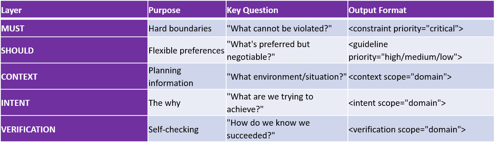

# Appendix C: Quick Reference Guide

**For:** Fast reference during specification writing

**When to use:** While actively writing specs, need quick reminders

**What you get:** Checklists, patterns, red flags, decision trees—all condensed

## How to Use This Guide

**This is your quick reference card:**

- Keep it open while writing specs
- Check relevant sections as you work
- Use checklists before finalizing
- Reference patterns when stuck

Not meant for learning (see Sections 1-7 for that).
Meant for doing (quick lookups while working).

## The Five Layers at a Glance



### MUST Layer Quick Reference

When to Use MUST
Use MUST for:

- Legal requirements (HIPAA, PCI-DSS, GDPR)
- Security boundaries (encryption, authentication)
- Performance hard limits (<200ms or system fails)
- Data integrity rules (no data loss, corruption prevention)
- Compatibility requirements (must work on iOS 15+)

Don't use MUST for

- Preferences (styling, naming conventions)
- Optimization goals (would like faster, but not critical)
- Nice-to-haves (features that would be good to add)
- Subjective qualities ("good", "clean", "elegant")

### MUST Checklist

Before finalizing MUST constraints:

```text

[ ] Is this truly non-negotiable? (Can we launch without it? If yes → SHOULD)
[ ] Is this specific? (Not "secure" but "bcrypt with salt rounds ≥12")
[ ] Is this measurable? (Can the model verify objectively?)
[ ] Is this actionable? (Does the model know what to do?)
[ ] Does this have a supremacy clause if needed? (When conflicts occur, what wins?)
[ ] Is verification protocol defined? (How to check compliance?)
```
### MUST Patterns

#### Pattern 1: Security Constraint

```text

<constraint priority="critical" scope="security">
MUST: [Specific security requirement]
MUST: [Authentication/authorization requirement]
MUST: [Data protection requirement]
RATIONALE: [Why this is required - legal, risk, etc.]

VERIFICATION:

[Specific test or audit to confirm compliance]
</constraint>
```

#### Pattern 2: Performance Constraint

```text

<constraint priority="critical" scope="performance">
MUST: [Specific metric] <[threshold] ([percentile])

Example: API response time <200ms (p95)

VERIFICATION:

Command: [load test command]

Expected: [specific result]

Pass criteria: [objective threshold]
</constraint>
```

#### Pattern 3: Compatibility Constraint

```text

<constraint priority="critical" scope="compatibility">
MUST: Support [platform/version] and above
MUST: Work with [existing system/tool]

RATIONALE:
[User base breakdown, integration needs]

VERIFICATION:

Test matrix: [specific versions/platforms to test]
</constraint>
```

### MUST Red Flags

Warning signs your MUST is problematic:

#### Vague language

**"Be secure", "Perform well", "Look good"**

**Fix:** Define specifically (e.g., "bcrypt salt rounds ≥12", "p95 <200ms", "WCAG 2.1 AA")

#### Subjective criteria:

**"Clean code", "Good UX", "Elegant"**

**Fix:** Define objectively (e.g., "Complexity <10", "80% task completion", "Pass Nielsen heuristics")

#### Too many MUSTs:

**50+ critical constraints**

**Fix:** Prioritize—some are SHOULD not MUST. Keep MUSTs to truly critical items.

#### Conflicting MUSTs:

**Response <100ms BUT query 10 databases (impossible!)**

**Fix:** Prioritize (which wins?) or relax one constraint to make both achievable.

#### Secret MUST disguised as SHOULD:

**"SHOULD use company auth (but really you must!)"**

**Fix:** Call it MUST if it's required. Be honest about rigidity.

### SHOULD Layer Quick Reference

#### When to Use SHOULD**

**Use SHOULD for:**

- Preferred approaches (but alternatives acceptable)
- Optimization goals (faster is better, but not critical)
- Style preferences (naming, formatting, conventions)
- Nice-to-have features (improve UX, not required)
- Best practices (recommended but context-dependent)

#### Don't use SHOULD for

- Legal requirements (those are MUST!)
- Hard performance limits (those are MUST!)
- Security requirements (those are MUST!)
- Anything non-negotiable (call it MUST!)

### SHOULD Checklist

Before finalizing SHOULD guidelines:

```text

[ ] Is there flexibility? (Can alternatives work?)
[ ] Are exceptions acceptable? (When would we violate this?)
[ ] Is the preference justified? (Why is this preferred?)
[ ] Are alternatives documented? (What else could work?)
[ ] Is there a decision framework? (When to choose A vs B?)
```

### SHOULD Patterns

#### Pattern 1: Preferred Approach with Alternatives

```text

<guideline priority="high">
SHOULD: [Preferred approach]

RATIONALE: [Why this is preferred]

ACCEPTABLE ALTERNATIVES:

- [Alternative 1] if [condition]
- [Alternative 2] if [condition]

WHEN VIOLATING:

Document rationale and get [stakeholder] approval
</guideline>
```

#### Pattern 2: Optimization Goal

```text

<guideline priority="medium">
SHOULD: [Optimization target]

Example: Aim for <100ms response time (p95)

RATIONALE: [Why this improves experience]

ACCEPTABLE: <200ms if [trade-off justifies it]

NOT ACCEPTABLE: >500ms (becomes MUST violation)
</guideline>
```

### SHOULD Red Flags

#### Actually required:

**"SHOULD comply with HIPAA (but it's required)"**

**Fix:** Make it MUST if it's truly required

#### No flexibility:

**"SHOULD use React (no alternatives allowed)"**

**Fix:** If no alternatives, it's MUST not SHOULD

#### Too rigid:

**"SHOULD be exactly 25 lines (no exceptions)"**

**Fix:** Add acceptable exceptions or make it a range

#### No rationale:

**"SHOULD prefer PostgreSQL (no explanation)"**

**Fix:** Explain WHY preferred (team expertise? specific features?)

### CONTEXT Layer Quick Reference

**What to Include in CONTEXT**

**Business Context:**

- Company stage (startup vs enterprise)
- Budget constraints
- Timeline pressures
- Competitive landscape
- Success metrics

**Technical Context:**

- Technology stack
- Team expertise
- Infrastructure constraints
- Existing systems
- Scale requirements

**User Context:**

- Who are the users?
- Tech proficiency
- Device/platform usage
- Pain points
- Success criteria

### CONTEXT Checklist

Before finalizing CONTEXT:

```text

[ ] Does this explain WHY constraints exist?
[ ] Does this inform priorities?
[ ] Is this specific to THIS project? (Not copy-pasted)
[ ] Does this help with trade-off decisions?
[ ] Is this current and accurate?
```

### CONTEXT Red Flags

#### Generic:

**"We're a technology company focused on innovation"**

**Fix:** Be specific (stage, size, market, constraints)

#### Copy-pasted:

**Context from different project/domain**

**Fix:** Customize to YOUR project

#### Too much history:

**5 pages of company background from 2010**

**Fix:** Focus on what's relevant NOW for THIS project

#### Irrelevant details:

**"Office has standing desks, free snacks"**

**Fix:** Include only context that affects technical decisions

### INTENT Layer Quick Reference

**What to Include in INTENT**

Primary Goal:

- One sentence: What are we trying to achieve?
- Measurable outcome preferred

Why This Matters:

- Business impact
- User impact
- Technical impact

Success Criteria:

- Specific metrics
- Observable behaviors
- Time-bound if relevant

Rationale for Key Decisions:

- Why approach A over B?
- What trade-offs are we making?
- Why are these trade-offs worth it?

Alignment Check:

- How do we know we're on track?
- What indicates we're drifting?
- When to course-correct?

### INTENT Checklist

Before finalizing INTENT:

```text

[ ] Is the goal clear and specific?
[ ] Is success measurable?
[ ] Are trade-offs explicitly stated?
[ ] Is rationale provided for key choices?
[ ] Is there an alignment check framework?
[ ] Does this answer "why" for MUST constraints?
```

### INTENT Patterns

#### Pattern 1: Goal + Trade-offs + Alignment

```text

<intent scope="domain">

**Primary Goal:**
[One sentence goal with metric]

**Why This Matters:**
[Business/user/technical impact]

**Success Looks Like:**
[Measurable outcomes, observable behaviors]

**Rationale for Key Decisions:**

- Why [choice A]: [reason, trade-off]
- Why [choice B]: [reason, trade-off]

**Trade-offs We Accept:**

- [What we sacrifice]: [why worth it]

- [What we prioritize over]

- [rationale]

**Alignment Check:**

On track if: [specific indicators]

Drifting if: [warning signs]
</intent>
```

### INTENT Red Flags

#### Vague goal:

**"Build a great product"**

**Fix:** Specific, measurable (e.g., "Reduce cart abandonment from 25% to 15%")

#### No trade-offs:

**"We want it fast AND perfect AND cheap"**

**Fix:** Acknowledge what you're prioritizing (e.g., "Speed over perfection for v1")

#### Missing rationale:

**"We chose React" (no explanation)**

**Fix:** Explain WHY (team expertise, ecosystem, performance, etc.)

#### No alignment check:

**How do you know if you're drifting?**

**Fix:** Define on-track indicators and warning signs

## VERIFICATION Quick Reference

**What to Include in VERIFICATION**

What to Verify:

- Which constraints to check
- Which success criteria to measure

How to Verify:

- Automated commands (specific)
- Manual checklists (objective)
- Expected results (clear)

When to Verify:

- During development (continuous)
- Pre-delivery (comprehensive)
- Post-deployment (monitoring)

If Verification Fails:

- What to do (fix? flag? escalate?)
- Recovery process
- Re-verification steps

Pass Criteria:

- Objective determination of success
- Clear thresholds
- No ambiguity

### VERIFICATION Checklist

Before finalizing VERIFICATION:

```text

[ ] All critical MUST constraints have verification
[ ] Verification is objective (not "looks good")
[ ] Verification is actionable (I can actually run this)
[ ] Expected results are clear
[ ] Pass/fail criteria are specific
[ ] Failure recovery is defined
```

### VERIFICATION Patterns

#### Pattern 1: Automated Verification

```text

<verification scope="domain">
**What to verify:**
[Specific constraint]

**How to verify:**

Command: [exact command to run]

Expected: [specific output/result]

Pass criteria: [objective threshold]

**If fails:**

1. [Diagnostic step]

2. [Fix step]

3. Re-verify
`</verification>`
```

#### Pattern 2: Manual Verification

```text

<verification scope="domain">

**What to verify:**
[Specific criteria]

**How to verify (manual checklist):**

- [Check item 1] (specific, observable)
- [Check item 2] (specific, observable)
- [Check item 3] (specific, observable)

**Pass criteria:**

All items confirmed

**If fails:**

Document which item failed and why, then address
</verification>
```

### VERIFICATION Red Flags

#### Vague criteria:

**"Verify code quality is good"**

**Fix:** Specific checks (linter passes, coverage >80%, complexity <10)

#### No verification for critical MUST:

**MUST has no matching verification**

**Fix:** Add specific verification protocol for each critical constraint

#### Subjective pass criteria:

**"Looks good to me"**

**Fix:** Objective criteria (specific metrics, thresholds, tests)

**No failure handling:** Verification fails, now what?
Fix: Define what to do when verification fails

## Common Patterns

### Pattern: The Supremacy Clause

**When to use:** Multiple critical constraints might conflict

```text

<constraint priority="critical" supremacy="true">

MUST: [Highest priority requirement]

SUPREMACY CLAUSE:

[This requirement] overrides ALL other requirements including

[list potential conflicts]. If any requirement conflicts with

[this], [this] wins without exception.

Example: HIPAA compliance overrides performance, features, and
user convenience.
</constraint>
```

### Pattern: The Exception Documentation

**When to use:**

SHOULD that might be violated

```text

<guideline priority="high">

SHOULD:
[Preferred approach]

ACCEPTABLE EXCEPTIONS:

- [Scenario 1]: [Alternative approach] because [reason]
- [Scenario 2]: [Alternative approach] because [reason]

WHEN VIOLATING:

1. Document specific rationale
2. Get [stakeholder] approval
3. Record in decision log
</guideline>

### Pattern: The Decision Framework

**When to use:** Multiple options, need to choose

```text

<intent scope="domain">

**Decision Framework:**

When [situation occurs], priority order:

1. [Highest priority] (non-negotiable)
2. [High priority] (important)
3. [Medium priority] (desirable)
4. [Lower priority] (nice-to-have)

Example:

- Request: Add feature X
- Analysis: Impacts priorities how?
- Decision: Accept/reject based on framework
- Rationale: [Which priority it serves/harms]
</intent>
```

## Decision Trees- Should This Be MUST or SHOULD?

```text

Is this legally required?

|─ YES → MUST
└─ NO → Continue

Is this a security requirement?

├─ YES → MUST
└─ NO → Continue

Will the system fail/break without it?

├─ YES → MUST
└─ NO → Continue

Can we launch without it?

├─ NO → MUST
└─ YES → Continue

Would alternatives be acceptable?

├─ NO → MUST
└─ YES → SHOULD

How Specific Should My MUST Be?

Is this a security/compliance requirement?

├─ YES → Be VERY specific (exact algorithms, versions)
└─ NO → Continue

Is this a hard performance limit?
├─ YES → Be specific (exact threshold, percentile)
└─ NO → Continue

Is this a compatibility requirement?

├─ YES → Be specific (exact versions, platforms)
└─ NO → Continue

Is this a quality guideline?

├─ YES → Consider making it SHOULD (quality often subjective)
└─ NO → Be as specific as makes sense

Do I Need CONTEXT for This?

Are my MUST constraints unusual/surprising?

├─ YES → Explain why in CONTEXT
└─ NO → Continue

Do priorities seem backwards?
├─ YES → Explain trade-offs in CONTEXT
└─ NO → Continue

Would someone ask "why this approach?"

├─ YES → Provide rationale in CONTEXT/INTENT
└─ NO → Minimal CONTEXT okay
```

## Quick Anti-Pattern Recognition

### Red Flag Phrases

**If you write these, stop and fix:**

- "Be secure" → Define HOW (bcrypt? TLS? encryption?)
- "Perform well" → Define WHAT (response time? throughput?)
- "Good UX" → Define WHAT (task completion? satisfaction score?)
- "Clean code" → Define WHAT (complexity? coverage? linting?)
- "Use best practices" → Define WHICH practices
- "Make it fast" → Define HOW FAST (metric + threshold)
- "Obviously" / "Clearly" → If obvious, state it explicitly
- "Just" / "Simply" → If simple, be specific about how

## Integration Check

Are your layers working together?

### Good Integration:

- MUST → Specific boundary
- CONTEXT → Explains why boundary exists
- INTENT → Clarifies what we're achieving with boundary
- VERIFICATION → Tests boundary is honored

**Example:**

- MUST: Response time <200ms (p95)
- CONTEXT: Cart abandonment increases 10% per second delay
- INTENT: Reduce abandonment from 25% to 15%
- VERIFICATION: Load test shows p95 <200ms

### Poor Integration:

- MUST: Response time <100ms
- CONTEXT: Users prefer thoroughness over speed
- INTENT: Build trust through careful validation
  
**LAYERS CONTRADICT!**

## Before You Finish Checklist

Final check before considering your spec complete:

```text

Completeness

[ ] All 5 layers present (MUST, SHOULD, CONTEXT, INTENT, VERIFICATION)
[ ] Each layer answers its question
[ ] No layer missing

Specificity

[ ] No vague terms without definition
[ ] Metrics have thresholds
[ ] Tools/technologies named explicitly
[ ] Success criteria measurable

Consistency

[ ] No contradictions between layers
[ ] Priorities clear when conflicts occur
[ ] Trade-offs explicitly acknowledged
[ ] Decision framework provided

Verifiability

[ ] All critical MUSTs have verification
[ ] Verification is objective
[ ] Pass criteria clear
[ ] Failure handling defined

Context

[ ] Specific to THIS project (not copy-pasted)
[ ] Current and accurate
[ ] Informs priorities and trade-offs
[ ] Explains unusual constraints

Intent

[ ] Goal is clear and measurable
[ ] Trade-offs stated
[ ] Rationale for key decisions provided
[ ] Alignment check framework exists
```

## Quick Templates

### Minimal Viable Spec Template

```text

<constraint priority="critical">

MUST:
[Most critical 3-5 requirements]

VERIFICATION:

[How to check each]
</constraint>

<context>
[Why these requirements exist]

[Key constraints/pressures]
</context>

<intent>

**Goal:** [What we're achieving]

**Success:** [How we measure it]
</intent>
```
**Use this when: Need something fast, will iterate later.**

### Complete Spec Template

```text

<constraint priority="critical">
MUST: [Hard boundaries - 5-10 items]

[With verification for each]
</constraint>

<guideline priority="high">

SHOULD: [Preferences - 5-10 items]

[With acceptable exceptions]
</guideline>

<context scope="business">

[Company, users, constraints, timeline]
</context>

<context scope="technical">

[Stack, team, infrastructure, scale]
</context>

<intent>

**Goal:** [Specific, measurable]

**Why:** [Impact]

**Success:** [Criteria]

**Trade-offs:** [What we accept]

**Alignment:** [How we track]
</intent>

<verification>
[Comprehensive checking for all critical items]
</verification>
```
**Use this when: Formal project, need complete specification.**

## Remember

**Specifications are:**

- Persistent (reusable across conversations)
- Precise (remove ambiguity)
- Verifiable (objective success criteria)

**Good specs enable:**

- No guessing (I know what to do)
- No rabbit holes (I stay on track)
- No conflicts (priorities clear)
- Quality output (verified compliance)

**Keep this guide handy while writing specs!**

## END OF APPENDIX C

Document Version: 1.0.0
Last Updated: 2026-02-27
Quick reference for active specification writing


