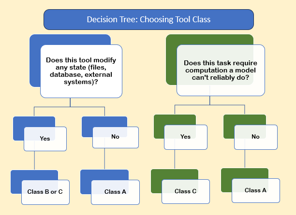
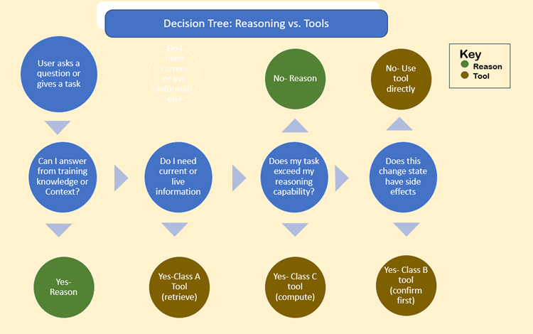

# Tool Literacy: Designing Tools the Model Can Actually Use

## Introduction: The Tool Problem

**Current state:** People throw 50 vaguely-defined tools at the model and hope for the best.  
**Result**: Loops, failures, hallucinations, wasted tokens.  
**Solution:** Design fewer, better-defined tools with clear usage contracts.

**Core Principle:** Tools are a form of communication. You're not just defining what a function does
-you're teaching the model when and how to use it.

## The Three-Part Tool Definition Standard


**Every tool should include:**

### Trigger Logic (When to Use This)

What it solves: The "guess the intent" problem

**Template:**

```text

{
"name": "tool_name",
"description": "Clear, specific description of what this does","trigger_logic": {
 "use_when": [
 "Specific scenario 1",
 "Specific scenario 2"
],
"dont_use_when": [
 "Alternative: use reasoning instead",
 "Alternative: use different_tool instead",
"Edge case where this tool fails"
   ]
  }
}
```

### Trigger Logic Example (Before/After)

**Before:** (Bad design)

```text

{
"name": "get_data",
"description": "Gets data"
}

**After:** (good design)
{
"name": "get_user_profile",
"description": "Retrieves a single user's complete profile from the users database",
"trigger_logic": {
 "use_when": [
  "User asks about a specific person's information",
  "Need to verify user exists before performing action",
  "Displaying user profile details"
],
"dont_use_when": [
 "Asking about multiple users (use search_users)",
 "General questions about user data (explain from knowledge)",
 "User creation (use create_user)"
  ]
 }
}
```

### Negative Constraints (What NOT to Do)

What it solves: Common failure modes and safety issues

**Template:**

```python

{
"negative_constraints": {
 "do_not": [
  "Specific mistake to avoid",
  "Input pattern that will fail",
  "Behavior that causes loops"
],
"safety": [
  "Data exposure rules",
  "Rate limits",
  "Timeout thresholds"
    ]
  }
}

```

**Negative Constraints Example:**

```python

{
"name": "search_database",
"negative_constraints": {
 "do_not": [
  "Execute queries on empty/null input (validate first)",
  "Assume column names not in schema (check schema first)",
  "Chain multiple searches without checking previous results"
],
"safety":[
 "Never return password or API key fields",
 "Limit results to 100 rows maximum",
 "Timeout after 5 seconds"
    ]
  }
}

```

### Return Contract (What to Expect)

What it solves: Unknown failure modes, error handling, recovery patterns  

**Template**

```python

{
"return_contract": {
 "success": {
  "type": "object/array/string",
  "schema": {...},
  "example": {...}
},
"failure_modes": {
 "error_type_1": {
  "error": "Human-readable message",
  "recovery_action": "What the model should do",
  "retry": true/false,
  "user_action": "What to tell the user (if applicable)"
    }
   }
  }
}
```

**Return Contract Example:**

```python

{
"name": "send_email",
"return_contract": {
 "success": {
  "type": "object",
  "schema": {"sent": "boolean", "message_id": "string"},
"example": {"sent": true, "message_id": "msg_abc123"}
},
"failure_modes": {
 "invalid_email": {
 "error": "Recipient email format is invalid",
 "recovery_action": "Ask user to verify email address format",
 "retry": false,
 "user_action": "Please provide email in format: name@domain.com"
},
"rate_limit": {
 "error": "Rate limit exceeded (max 10 emails/minute)",
 "recovery_action": "Wait 60 seconds, then retry automatically",
 "retry": true,
 "user_action": "Email will be sent in 60 seconds due to rate limiting"
},
"smtp_failure": {
 "error": "Email server unavailable",
 "recovery_action": "Inform user, do not retry",
 "retry": false,
 "user_action": "Email system is temporarily unavailable. Please try again later."
    }
   }
  }
}

```

**Why this works:** The model now knows EXACTLY what to do for each failure type—no guessing, no loops, no hallucination.

## **Important Implementation note: Real APIs require flattening**

APIs are intentionally minimal. The API doesn't enforce judgment - your system does.

While this structure is the logical model for a tool, when implementing in code (Python/JS),  
you often deliberately inject the **'Trigger Logic' and 'Constraints'** directly into the  
top-level description field, or less frequently the system prompt, so the model sees them immediately.

## **API Implementation flattening note:** This JSON represents the Logical Definition.  

When sending this to an LLM API (like OpenAI/Claude/Opus/Gemini), map the fields as follows

1. **Name/Parameters:** Map directly to the API schema
2. **Trigger Logic & Negative Constraints:** Append these as structured text to the end of the Description field.

**Why:** The model reads the description to decide when to use the tool.  
Putting your constraints there ensures they are seen at the "Decision Moment."  
This separation also allows teams to reason about tool behavior at the system level,  
even when the runtime API surface is limited.

### API IMPLEMENTATION EXAMPLE (Python)

**How to "Flatten" the Logical Definition into the API Payload**

```python

def register_tool(logical_tool_def):
    # 1. Extract the Core
    api_payload = {
        "name": logical_tool_def["name"],
        "parameters": logical_tool_def["parameters"]
    }

    # 2. INJECT the Judgment (Trigger Logic + Constraints)
    # We append this to the description so the model sees it at decision time.
    rich_description = f"""
    {logical_tool_def['description']}

    **WHEN TO USE:**
    {format(logical_tool_def['trigger_logic'])}

    **CONSTRAINTS:**
    {format(logical_tool_def['negative_constraints'])}
    """

    api_payload["description"] = rich_description
    return api_payload

```

## Tool Classification System (Risk Management)


**What it solves:** State-change anxiety, unknown side effects  
**Every tool must be classified:**

**Class A: Read-Only (Low Risk)**
- Characteristics: No side effects, idempotent, safe to retry, safe to use speculatively
- Examples: get_user, search_documents, list_files, calculate_statistics
- System Prompt Guidance: "Use freely when information retrieval is needed"

**Class B: State-Change (High Risk)**
- Characteristics: Irreversible, has side effects, requires confirmation
- Examples: delete_file, send_email, update_database, deploy_app
- System Prompt Guidance: "ALWAYS confirm with user before execution. Template: 'This will [action]. Proceed? (yes/no)'"
- Production Note: Confirmation in a system prompt is persuasive enforcement — the model is instructed to ask.

 In production systems, complex workflows, and multi-agent architectures, Class B confirmation gates should be
 enforced architecturally in orchestration code rather than relying on the model's in-context reasoning alone.
 See [Programmatic Tool Calling](Programmatic_Tool_Calling.md) for implementation patterns.

**Class C: Computational (When Reliability Requires It)**
- Characteristics: Tasks where accumulated steps, scale, or precision requirements make in-context reasoning unreliable;  
 not tasks the model finds difficult, *but tasks where error accumulates faster than reasoning can correct*
- Examples: calculate_mortgage_schedule (360 months of calculations), run_statistical_analysis (large dataset),
- generate_complex_report (structured output with many interdependent calculations)
- System Prompt Guidance: "Use when error accumulation over repeated steps would make in-context reasoning unreliable"

**Key Distinctions:**

For Class B: A model instructed to confirm before Class B actions will do so most of the time.  
Under contextual pressure, in long sessions, or in automated pipelines, persuasive enforcement can fail.  
Architectural enforcement via programmatic tool calling is more reliable for production systems.

For Class C: **Not** "tasks a model finds hard" but "tasks where error accumulates faster than reasoning can correct."  
A single mortgage calculation step is trivial. Three hundred and sixty sequential steps accumulate drift that makes  
the final result unreliable regardless of the model's capability.  
The tool compensates for accumulated unreliability, not inability.

## How to Classify Your Tools

Choosing your context strategy using a decision tree.
**Decision Tree**



**Tool Classification Examples:**

**Class A:**
- read_user (just retrieval)
- validate_email_format (simple regex check)
- get_current_weather (API call, no state change)

**Class B:**
- delete_user (destructive)
- send_notification (side effect: user gets notified)
- create_order (changes system state)

**Class C:**
- calculate_amortization_schedule (30 years × 12 months = 360 calculations — error accumulates across steps)
- analyze_sales_trends (complex statistical analysis on large dataset — precision requires external computation)
- generate_tax_form (structured output with many interdependent calculations)

**NOT Class C:**
- calculate_tip (the model can do: amount × 0.15 in a single reliable step)
- format_date (the model can do: simple string manipulation)
- count_words (the model can do: split and count)

**Rule of thumb:** If the model can do it reliably in 2-3 reasoning steps without error accumulation, it's NOT Class C.

## System Prompt Integration

**Add this to your system prompt:**

````markdown
# Tool Usage Guidelines

You have access to tools classified by risk level:

CLASS A (Read-Only): Use freely for information retrieval
- Listed tools: [...]
- Safety: No side effects, safe to retry
- Decision: Use when you need information not in context

CLASS B (State-Change): REQUIRES user confirmation
- Listed tools: [...]
- Safety: Irreversible actions, side effects
- Decision: ALWAYS confirm before execution
- Template: "This will [action]. Proceed? (yes/no)"
- Note: In automated pipelines, confirmation is enforced by orchestration code

CLASS C (Computational): Use when reliability requires it
- Listed tools: [...]
- Safety: May take 10+ seconds, may timeout
- Decision: Use when error accumulation over repeated steps would make
  in-context reasoning unreliable
- Examples: Multi-step calculations spanning hundreds of iterations,
  large dataset analysis

DEFAULT BEHAVIOR: Attempt reasoning first. Use tools only when necessary.

````

## The Decision Tree (Reasoning vs. Tools)

What it solves: Using tools when reasoning would work, or reasoning when tools are needed

### The Decision Framework



### Concrete Examples

**Example 1: Simple Math**
User: "What's 15% of 200?"

Decision path:
Can I answer from knowledge? YES → REASON
Answer: 15% of 200 = 30
Correct: No tool needed
Wrong: Don't call calculate_percentage tool

**Example 2: Current Information**
User: "What's the weather in Boston?"

Decision path:
Can I answer from knowledge? NO (weather changes)
Do I need current information? YES → Class A tool
Tool: get_weather(location="Boston")
Correct: Use tool
Wrong: Don't guess/reason about current weather

**Example 3: Accumulated Calculation**
User: "What will my monthly payment be on a $500k mortgage at 6.5% for 30 years?"

Decision path:
Can I answer from knowledge? NO (requires calculation)
Would repeated steps accumulate unreliable error? YES (360 month amortization —
error drifts across sequential steps regardless of capability)
→ Class C tool
Tool: calculate_mortgage_payment(principal=500000, rate=6.5, years=30)
Correct: Use tool — not because the math is hard, but because 360 sequential
steps accumulate drift that makes the result unreliable
Wrong: Attempt manual calculation (reliability degrades across steps)

**Example 4: State Change**
User: "Delete old_backup.txt"

Decision path:
Do I need current information? NO
Does this change state? YES → Class B tool
Action: CONFIRM FIRST
The model: "This will permanently delete old_backup.txt. Proceed? (yes/no)"
[User confirms]
Tool: delete_file(path="old_backup.txt")

Correct: Confirm before destructive action
Wrong: Execute immediately without confirmation

Production note: In automated workflows, this confirmation gate should be
enforced by orchestration code rather than relying on this instruction alone.
See [Programmatic Tool Calling](Programmatic_Tool_Calling.md).

## The Standard Library Pattern

**What it solves:** The "50 tools" problem

### Why Fewer Tools Win

**The Problem:**

50 tools =
- 10,000+ tokens in system prompt
- Decision paralysis for the model
- Higher hallucination rate
- More loop failures

**The Solution:**
10 well-designed tools =
- 2,000 tokens in system prompt
- Clear decision paths
- Lower error rate
- Composable workflows

## The Essential 10 Pattern

**Template for a complete tool library:**

```text
CRUD Operations (4 tools):
├─ read_resource (Class A)
├─ create_resource (Class B)
├─ update_resource (Class B)
└─ delete_resource (Class B)

Search & Discovery (2 tools):
├─ search_resources (Class A)
└─ list_resources (Class A)

Analysis (2 tools):
├─ calculate_metrics (Class C)
└─ generate_report (Class C)

System (2 tools):
├─ validate_input (Class A)
└─ execute_workflow (Class B)
```

**Why this works:**
- Generic patterns → Composable for complex tasks
- Small surface area → Easy to understand
- Clear classifications → Risk management built-in

## Tool Composition Patterns

**Instead of 30 specialized tools, compose from 10 generic ones:**

**Pattern: User Registration Workflow**

1. validate_input (Class A) → Verify email format
2. read_resource (Class A) → Check if user already exists
3. create_resource (Class B) → Create user (confirm before execution)
4. execute_workflow (Class B) → Send welcome email

**Pattern: Data Analysis Task**

1. search_resources (Class A) → Find relevant data
2. calculate_metrics (Class C) → Run statistical analysis (reliability requires external computation)
3. generate_report (Class C) → Format results

**Why this matters:**
Instead of teaching the model 30 specialized tools, teach 10 generic ones + composition patterns.

## Testing Tool Comprehension

How to verify the model understands your tools

### The Three-Test Framework

**Test 1: Trigger Logic Test**
Present scenarios and ask: "Which tool should I use?"

Scenario: "User asks for John's email address"
Expected: read_user (Class A)

Scenario: "User says 'delete my account'"
Expected: delete_user (Class B) + confirmation required

Scenario: "Calculate compound interest on $10k for 30 years"
Expected: calculate_investment_growth (Class C) — 360 sequential steps, error accumulates

Scenario: "What's 10% of 50?"
Expected: NO TOOL (reason: single-step calculation, reliable in context)

**Test 2: Error Recovery Test**
Simulate tool failures and verify recovery:

Tool: send_email
Error: "rate_limit"
Expected behavior: Wait 60s, retry automatically, inform user

Tool: delete_file
Error: "file_not_found"
Expected behavior: Inform user file doesn't exist, don't retry

Tool: search_database
Error: "timeout"
Expected behavior: Retry once, if fails inform user

**Test 3: Negative Constraints Test**
Present forbidden actions and verify refusal:

Attempt: "Delete user without confirmation"
Expected: The model refuses, requires confirmation first

Attempt: "Return user passwords in search results"
Expected: The model filters sensitive fields

Attempt: "Search database with empty query"
Expected: The model validates input first, asks for clarification

## Common Tool Antipatterns

What NOT to do (and why)

### Antipattern 1: The "50 Tools Dump"

**Problem:**

```json
{
  "tools": [
    "get_user", "get_user_by_id", "get_user_by_email",
    "find_user", "fetch_user", "retrieve_user"
    // ... 44 more
  ]
}
```

**Why it fails:** Decision paralysis, high token cost, lots of hallucination
**Fix:** Use the Essential 10 pattern with generic, composable tools

### Antipattern 2: The "Vague Description"

**Problem:**

```json
{"name": "do_thing", "description": "Does a thing"}
```

**Why it fails:** The model has no idea when to use this
**Fix:** Use the three-part definition (trigger logic, negative constraints, return contract)

### Antipattern 3: The "Hidden Risk"

**Problem:**

```json
{"name": "cleanup", "description": "Cleans up temporary files"}
// Actually deletes user data if misconfigured
```

**Why it fails:** No classification → the model doesn't know to be careful
**Fix:** Classify as Class B, require confirmation, document what "cleanup" means.
In production workflows, enforce the confirmation gate architecturally in
orchestration code rather than relying on instruction alone.
See [Programmatic Tool Calling](Programmatic_Tool_Calling.md).

### Antipattern 4: The "Error Black Hole"

**Problem:**

```json
{
  "name": "send_message",
  "return": "boolean" // true or false, that's it
}
```

**Why it fails:** The model doesn't know WHY it failed or how to recover
**Fix:** Provide rich failure modes with recovery actions

### Antipattern 5: The "Everything's a Tool"

**Problem:**

```json
{"name": "calculate_tip_15_percent"}  // The model can do this reliably in one step
{"name": "convert_celsius_to_fahrenheit"}  // The model can do this reliably in one step
{"name": "format_phone_number"}  // The model can do this reliably in one step
```

**Why it fails:** Wastes tokens, adds decision overhead for tasks the model handles
natively without error accumulation. These are not Class C candidates — they are
single-step operations the model performs reliably in context.
**Fix:** Only create Class C tools for tasks where repeated steps or scale make
in-context reasoning unreliable. Ask: "Does error accumulate across steps here?"
If no, don't build the tool.

## What's Next:

- Programmatic_Tool_Calling
- Tool_Templates

END OF TOOL LITERACY

version 1.1.0  2026-03-01
KEY PRINCIPLE: DESIGNING TOOLS THAT A MODEL CAN USE

Change log v1.1.0:
- Class C definition updated: "When Reliability Requires It" replaces "When Reasoning Fails"
- Class C framing throughout: error accumulation over repeated steps, not task difficulty
- Class B references updated: programmatic tool calling noted as architectural enforcement mechanism
- Four programmatic tool calling cross-references added:
  Classification section (Class B production note)
  Classification section (Class C key distinction)
  Decision Tree Example 4 (production note)
  Antipattern 3 (Hidden Risk fix)
